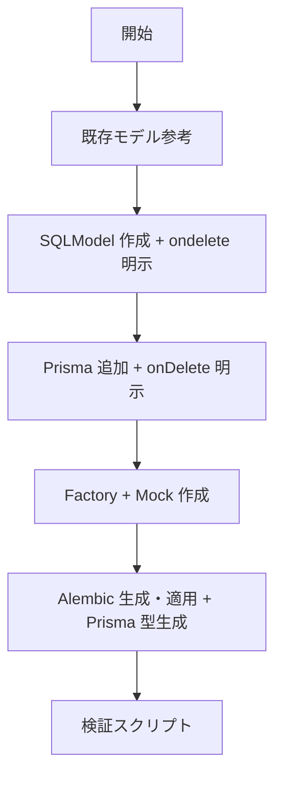

# データベース操作

## 概要

SQLModel + Prisma を片側だけにせず両方同時に整え、Factory / Mock / マイグレーションまで完走させる。

## 鉄則

- **SQLModel と Prisma は同時修正しろ**（片側だけは不整合の温床）
- **既存モデルのパターンを完全踏襲しろ**（独自構造は禁物。`tickets` 等の既存を参考に）
- **ForeignKey には必ず `ondelete` / `onDelete` を明示しろ**（CASCADE / RESTRICT / SET NULL を選定。flake8 で強制）
- **リレーションは双方向で漏らすな**（`back_populates` + `cascade_delete` / Prisma 側 `onDelete`）

## 使用場面

- 新規モデルの追加
- 既存モデルのスキーマ変更
- リレーション追加・変更
- Factory / Mock / Seed の追加
- 例外: `api/alembic/versions/` の手動編集は禁止（SQLModel を直して autogenerate）

## 手順



### Step 1: 既存モデルを参考にしろ

`api/src/<既存ドメイン>/models.py` と `client/prisma/schema.prisma` の同種モデルを `Read` で確認し、構造・命名・リレーション定義を踏襲しろ（senri は `api/src/<domain>/models.py` 構造で、`models/` サブディレクトリは無い）。

### Step 2: SQLModel を作成しろ

- パス: `api/src/<name>/models.py`
- テンプレート: `templates/SQLMODEL-TEMPLATE.py`

| 項目 | 設定 |
|------|------|
| 継承 | `BaseModel, table=True` |
| 文字列制限 | `@dataclass(frozen=True)` で Constraints 定義 |
| 循環インポート | `if TYPE_CHECKING:` で回避 |
| ForeignKey | `sa_column=Column(PGUUID(...), ForeignKey("...", ondelete=...), nullable=..., index=True)` で `ondelete` 必須 |
| 親リレーション | `back_populates="子のリレーション名"` |
| 子リレーション | `cascade_delete=True` + `back_populates`（DB レベル `ondelete="CASCADE"` と併用可） |

### Step 3: Prisma に追加しろ

- パス: `client/prisma/schema.prisma`
- テンプレート: `templates/PRISMA-TEMPLATE.prisma`
- `onDelete` を SQLModel の `ondelete` と整合させろ
- `@@map("テーブル名")` でスネークケース、外部キーは `@map("snake_case")`

| SQLModel | Prisma |
|----------|--------|
| `String(N)` | `@db.VarChar(N)` |
| `Text` | `String?` |
| `nullable=True` | `?` |
| `index=True` | `@@index([field])` |
| `cascade_delete=True` / `ondelete="CASCADE"` | `onDelete: Cascade` |
| `back_populates` | 双方向で定義 |

### Step 4: Factory + Mock を作成しろ

**Factory**: `api/src/<name>/factories.py`（テンプレ: `templates/FACTORY-TEMPLATE.py`）

| 項目 | 設定 |
|------|------|
| 継承 | `BaseFactory[Model]` |
| 除外フィールド | `id` / `created_at` / `updated_at` / `*_id`（外部キー） |
| ダミーデータ | `Faker("sentence")` 等 |
| 型ヒント | `# type: ignore[assignment]` を付与 |

**Mock**: `client/src/test/models/<name>.ts`（テンプレ: `templates/MOCK-TEMPLATE.ts`）

| 項目 | 命名 | 例 |
|------|------|-----|
| ファイル名 | ケバブケース | `thread-messages.ts` |
| 関数 | `createMock{Model}` | `createMockThreadMessage` |
| 単一 | `mock{Model}` | `mockThreadMessage` |
| 配列 | `mock{Models}` | `mockThreadMessages` |

1 ファイル 1 モデル。Prisma 型をインポート: `import type { Model } from '@prisma/client'`

### Step 5: Alembic 生成・適用 + Prisma 型生成

```bash
docker compose exec -T api uv run alembic revision --autogenerate -m "add <name> table"
docker compose exec -T api uv run alembic upgrade head
cd client && bun run generate-prisma
```

ドリフト検査: `sh project_check.sh -acheck`。autogenerate に検出されない場合のみ「停止して相談」へ。

### Step 6: 検証スクリプトを実行しろ

```bash
.claude/skills/database-operations/scripts/validate-model.sh [model_name]
```

## 検証チェックリスト

- [ ] SQLModel と Prisma を両方追加・整合
- [ ] 全 ForeignKey に `ondelete` / `onDelete` 明示
- [ ] リレーションを双方向で定義（`back_populates` + 反対側）
- [ ] Factory + Mock を作成（命名規則準拠、1 ファイル 1 モデル）
- [ ] Alembic 生成・適用 + Prisma 型生成
- [ ] 検証スクリプト pass

全項目をチェックできない場合、モデル追加は完了していない。Step 1 に戻れ。

## よくある言い訳

| 言い訳 | 現実 |
|---|---|
| 「Prisma だけ更新して SQLModel は後で」 | 後で = 不整合の固定化。同時に直せ |
| 「`ondelete` はデフォルト挙動でよい」 | DB ごとに挙動が違う。flake8 で強制されている。明示しろ |
| 「リレーションは片側だけで動く」 | 片側だけだと反対方向の取得で破綻。双方向で定義 |

## 危険信号 - 停止

以下に気付いたら即座に作業を止め、Step 1 に戻れ。

- `api/alembic/versions/` を手で開こうとした → 手動編集禁止。SQLModel を直して autogenerate
- `__init__.py` に import を書こうとした → 空ファイル維持。Alembic 認識は別仕組み
- 既存モデル未参照で独自構造を書き始めた → Step 1 必須
- ForeignKey に `ondelete` を付けずに進もうとした → flake8 で落ちる前に明示しろ

## アンチパターン

| ❌ NG | ✅ OK |
|---|---|
| ForeignKey に `ondelete` なし | `ondelete="CASCADE"` / `RESTRICT` / `SET NULL` を選定して明示 |
| Mock を 1 ファイルに複数モデル定義 | 1 ファイル 1 モデル。`thread-messages.ts` / `threads.ts` を分離 |
| `alembic/versions/` 手動編集 | SQLModel を直して `alembic revision --autogenerate` |
| リレーション片側のみ定義 | 親子双方に `back_populates` を書く |
| `__init__.py` に集約 import | 空ファイル維持 |

## 停止して相談すべき時

質問は 1 セッション 0〜1 回が上限。後から覆せない判断のみ確認しろ。

- `ondelete` の選定（CASCADE / RESTRICT / SET NULL）が業務知識を要する
- マイグレーションが既存データの破壊を伴う（カラム削除・型変更等）
- autogenerate に新モデルが検出されない（import 設定の調整が必要な可能性）

## 連携

- 前段スキル: なし
- 後続スキル: なし
- 関連スキル: なし

## 結論

SQLModel と Prisma の片側更新は、後続作業の不整合の温床だ。
