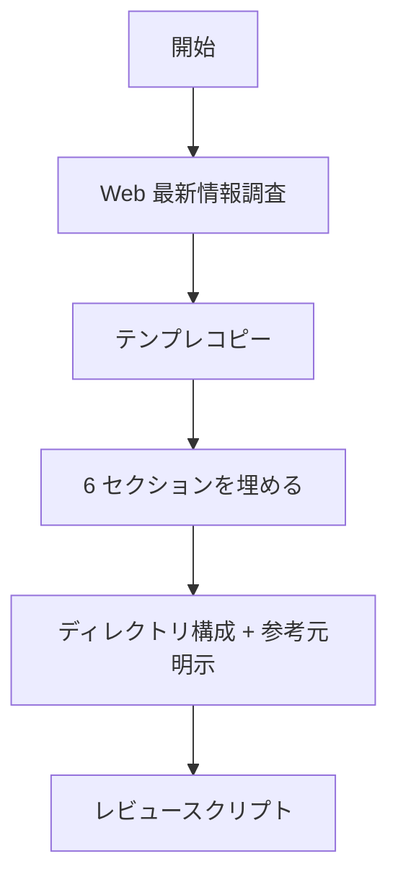

# 設計書作成

## 概要

`docs/design/[feature-name]-design.md` に設計書を作成する。シーケンス図 / フローチャート / テーブルで視覚化し、既存ディレクトリ構成を踏襲して参考元を明示する。

## 鉄則

- **書く前に最新ベストプラクティスを Web 調査しろ**（公式ドキュメント / GitHub 公式 / 直近 1 年の技術記事）
- **文章 < テーブル < 図 で表現しろ**（書きすぎず視覚化）
- **TODO を残すな**（設計が完了してから書く）
- **既存パターンを明示しろ**（新規ディレクトリは参考元 `← 既存: xxx を参考` を必ず記載）
- **DRY**（同じ情報を複数箇所に書くな）

## 使用場面

- 新機能追加の設計（API 追加 / 新画面 / 新モジュール / 新テーブル）
- 既存機能の仕様変更（DB スキーマ変更 / API 変更 / 認可ルール変更）
- リファクタ前の設計（責務分割 / アーキテクチャ刷新）
- ユーザーから「設計して」「設計書を書いて」「アーキテクチャを考えて」と指示があった時
- 例外: バグ修正のみ・タイポ修正・依存バージョンアップは対象外（設計書不要）

## 手順



### Step 1: 最新ベストプラクティスを調査しろ

| 優先度 | 情報源 |
|--------|--------|
| 1 | 公式ドキュメント |
| 2 | GitHub 公式リポジトリ |
| 3 | 技術ブログ（直近 1 年以内） |

`WebSearch` / `WebFetch` で調査。スキップ不可。

### Step 2: テンプレートをコピーしろ

`templates/DESIGN-TEMPLATE.md` を `docs/design/[feature-name]-design.md` にコピー。
ファイル名は kebab-case（例: `ticket-attachments-design.md`）。

### Step 3: テンプレの 6 セクションを順に埋めろ

DESIGN-TEMPLATE.md には全項目（必須 6 セクション / 各セクションの必須項目 / 「修正なし」記載例）が既に含まれている。
**テンプレ内の `<!-- コメント -->` の指示に従って埋めるだけ**。SKILL.md でセクション内容を再定義しない（DRY）。

| # | セクション |
|---|------------|
| 1 | 概要（目的 / 背景 / EARS 要件分析） |
| 2 | データベース設計 |
| 3 | 処理フロー |
| 4 | ディレクトリ構成 |
| 5 | バックエンド設計 |
| 6 | フロントエンド設計 |

セクション 2 / 5 / 6 は変更がなければ「修正なし」と明記しろ（空欄にするな）。

### Step 4: ディレクトリ構成は参考元と命名規則を明示しろ

| 記号 | 意味 |
|------|------|
| `# 新規` | 新規作成 |
| `# 変更` | 既存ファイル変更 |
| `← 既存: xxx を参考` | 参考元ディレクトリ |
| `（新規パターン）` | 参考元がない新規設計 |

**API / フロントのディレクトリ命名規則**（Rails resource/resources 方式）:

| 条件 | 命名 | 例 |
|------|------|-----|
| index（一覧）が必要 | 複数形 | `tickets/`, `users/` |
| index（一覧）が不要 | 単数形 | `auth/`, `my/` |

`api/src/` / `api/tests/`（テストファースト前提で必須）/ `client/src/` を含めろ。
プロジェクト構造は [references/project-structure.md](references/project-structure.md) を参照。

### Step 5: レビュースクリプトを実行しろ

```bash
.claude/skills/design-document-creator/scripts/review.sh docs/design/[feature-name]-design.md
```

## 検証チェックリスト

- [ ] Web 最新情報を調査した（公式ドキュメント / GitHub 公式 / 直近 1 年の技術記事）
- [ ] 必須 6 セクションを埋めた（修正なしは「修正なし」と明記）
- [ ] 新規ディレクトリに参考元（`← 既存: xxx を参考` または `（新規パターン）`）を記載
- [ ] API / フロント ディレクトリ命名（複数形 / 単数形）を Rails 方式に揃えた
- [ ] TODO が残っていない
- [ ] レビュースクリプトが pass

全項目をチェックできない場合、設計書は完了していない。Step 1 に戻れ。

## よくある言い訳

| 言い訳 | 現実 |
|---|---|
| 「自分の知識で書ける、Web 調査は省略」 | 知識は古い。Step 1 必須 |
| 「文章で十分伝わる」 | 文章はスキップされる。テーブルか図に変換しろ |
| 「設計の細部はあとで詰める、TODO で残す」 | TODO 設計書は腐る。完了してから書け |
| 「新規ディレクトリだから参考元なし」 | 必ず似た既存はある。なければ「（新規パターン）」と明記 |

## 危険信号 - 停止

以下に気付いたら即座に作業を止め、Step 1 に戻れ。

- Web 調査せずに書き始めた → Step 1 必須
- TODO / 未確定箇所を残したまま完了宣言しかけた → 設計を詰めてから書け
- 新規ディレクトリに参考元注記を忘れた → 既存ディレクトリを `Grep` で探し参考元を明示
- 必須 6 セクションのうち「修正なし」を空欄で済ませた → 「修正なし」と明記しろ

## アンチパターン

| ❌ NG | ✅ OK |
|---|---|
| Web 調査スキップ | `WebSearch` / `WebFetch` で公式 → GitHub → ブログの順で調査 |
| 文章だけで設計を説明 | テーブル + 図（シーケンス / フロー / ER）で視覚化 |
| 「TODO: 後で詰める」を残す | 設計を完了してから書く |
| 新規ディレクトリの参考元を書かない | `← 既存: xxx を参考` または `（新規パターン）` を必ず記載 |
| 同じ情報を複数セクションに重複記載 | DRY。1 箇所に書いて他は参照 |

## 停止して相談すべき時

質問は 1 セッション 0〜1 回が上限。後から覆せない判断のみ確認しろ。

- 採用技術 / アーキテクチャパターンの選定にビジネス文脈が必要
- 既存パターンが複数候補ありどれを参考にすべきか判断不能
- 必須 6 セクションのうち「対象外」と判断した範囲が広く、設計書として成立するか不明

## 連携

- 前段スキル: なし
- 後続スキル: なし
- 関連スキル:
  - `database-operations`（セクション 2 で DB 設計が確定したら、実装時にこの skill を呼ぶ）
  - `test-quality-validation`（テストファースト前提のため、設計確定後にテスト計画レビューで併用）

## 結論

調査なしの設計書は、ハルシネーションの温床だ。
