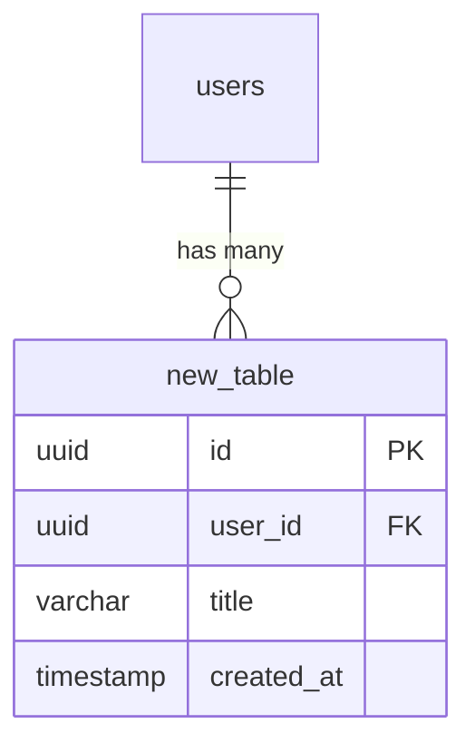
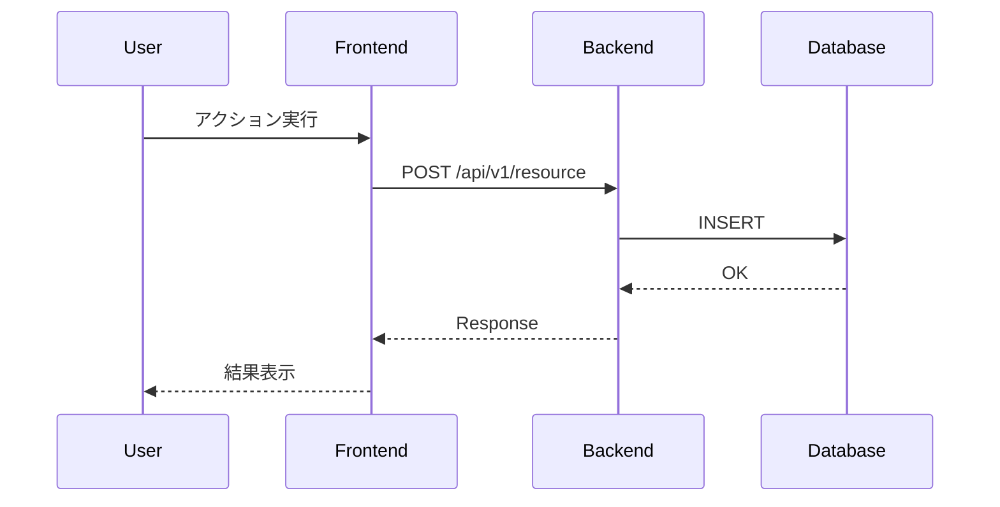
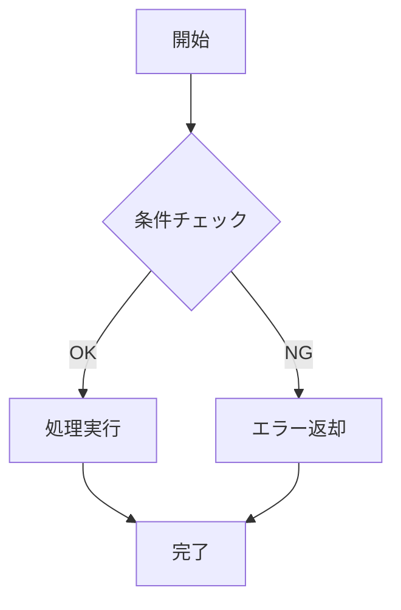

# [機能名] 設計書

> **最終更新**: YYYY-MM-DD
> **ステータス**: Draft | Review | Approved

---

## 1. 概要

### 1.1 目的

<!-- 1-2文で機能の目的を記述 -->

### 1.2 背景

<!-- なぜこの機能が必要か、どのような経緯で実装するかを記述 -->

### 1.3 要件分析（EARS方式）

#### Ubiquitous（常時有効）

| ID | 要求 |
|----|------|
| U-01 | システムは〜を提供するものとする |

#### Event-Driven（イベント駆動）

| ID | トリガー | 要求 |
|----|----------|------|
| E-01 | When ユーザーが〜した時 | システムは〜するものとする |

#### State-Driven（状態駆動）

| ID | 状態 | 要求 |
|----|------|------|
| S-01 | While 〜の間 | システムは〜するものとする |

#### Unwanted Behavior（異常系）

| ID | 条件 | 対処 |
|----|------|------|
| UB-01 | If 〜の場合 | then システムは〜するものとする |

#### Optional Features（オプション）

| ID | 条件 | 要求 |
|----|------|------|
| O-01 | Where 〜の場合 | システムは〜するものとする |

---

## 2. データベース設計

<!-- 修正がない場合は「修正なし」と記載し、関連テーブル名を列挙 -->

### 2.1 変更概要

| テーブル | 操作 | 内容 |
|---------|------|------|
| new_table | 追加 | 新規テーブル作成 |
| existing_table | 変更 | カラム追加: `new_column` |
| old_table | 削除 | 不要テーブル削除 |

<!-- 修正なしの場合は以下のように記載 -->
<!-- 修正なし（関連テーブル: users, tickets） -->

### 2.2 ER図



### 2.3 Enum定義（追加・変更・削除時）

```python
class NewStatus(str, Enum):
    ACTIVE = "ACTIVE"
    INACTIVE = "INACTIVE"
```

<!-- Enumの変更がない場合はこのセクションを省略可能 -->

---

## 3. 処理フロー

### 3.1 メインフロー



### 3.2 状態遷移（必要な場合）



---

## 4. ディレクトリ構成

### 4.1 変更対象ファイル一覧

```text
<root>/
├── api/src/
│   ├── models/
│   │   └── [new_model]/              # 新規 ← 既存: models/tickets/ を参考
│   │       ├── __init__.py
│   │       ├── models.py
│   │       └── factories.py
│   ├── routers/
│   │   └── member/
│   │       └── [resource]/           # 新規 ← 既存: routers/member/tickets/ を参考
│   │           ├── __init__.py
│   │           ├── routers.py
│   │           └── base_schemas.py
│   └── lib/
│       └── [service]/                # 新規 ← 既存: lib/utils/ を参考
│           ├── __init__.py
│           └── client.py
│
├── api/tests/
│   ├── unit/
│   │   └── [layer]/                  # 新規 ← 既存: tests/unit/auth/ を参考
│   │       └── test_[feature].py
│   └── integration/
│       └── member/
│           └── [resource]/           # 新規 ← 既存: tests/integration/member/threads/ を参考
│               └── test_[feature].py
│
└── client/src/
    ├── components/
    │   ├── atoms/button/
    │   │   └── [feature]/            # 新規 ← 既存: atoms/button/clear/ を参考
    │   │       └── index.tsx
    │   └── substances/member/
    │       └── [ui-pattern]/         # 新規 ← 既存: substances/member/form/ を参考
    │           └── [component].tsx
    ├── lib/
    │   └── [feature]/                # 新規 ← 既存: lib/auth/ を参考
    │       └── index.ts
    ├── hooks/ui/
    │   └── use-[feature]/            # 新規 ← 既存: hooks/ui/use-mobile/ を参考
    │       ├── index.ts
    │       └── index.test.ts
    └── websocket/features/
        └── [feature]/                # 新規 ← 既存: websocket/features/tickets/ を参考
            ├── events.ts             # イベント定義
            ├── handlers.ts           # イベントハンドラー
            ├── types.ts              # 型定義
            └── index.ts              # エクスポート
```

---

## 5. バックエンド設計

<!-- 修正がない場合は「修正なし」と記載 -->

### 5.1 パッケージ要件

| パッケージ | バージョン | 用途 |
|-----------|-----------|------|
| fastapi | 既存 | WebSocketエンドポイント |
| websockets | 既存 | WebSocket通信 |
| [new-package] | x.y.z | [用途] |

### 5.2 認証・認可

<!-- 既存パターンを踏襲する場合は「既存の〇〇と同様」と明記 -->
<!-- 変更がない場合は「修正なし」と記載 -->

| エンドポイント | 認証 | 認可 |
|---------------|------|------|
| `/member/[resource]` | JWT（Header） | Member権限 |
| `/member/[resource]/ws` | JWT（QueryParam） | Member権限 |

※ 既存の`/member/threads`と同様のパターン

### 5.3 エンドポイント一覧

| メソッド | パス | 説明 |
|----------|------|------|
| POST | `/member/[resource]` | 新規作成 |
| GET | `/member/[resource]/{id}` | 詳細取得 |
| WebSocket | `/member/[resource]/ws` | リアルタイム通信 |

### 5.4 メッセージフォーマット（WebSocket）

**Request:**

```json
{
  "type": "event_type",
  "data": {}
}
```

**Response:**

```json
{
  "type": "response_type",
  "data": {}
}
```

---

## 6. フロントエンド設計

<!-- 修正がない場合は「修正なし」と記載 -->

### 6.1 画面デザイン

<!-- UIの配置・レイアウトを視覚的に記述 -->

```text
[例: ボタン配置]
┌─────────────────────────────────┐
│ [TextArea                     ] │
│ [🎤] [📎] [➤ Send]              │
└─────────────────────────────────┘
```

### 6.2 パッケージ要件

| パッケージ | バージョン | 用途 |
|-----------|-----------|------|
| react | 既存 | UIフレームワーク |
| lucide-react | 既存 | アイコン |
| [new-package] | x.y.z | [用途] |

### 6.3 認証・認可

<!-- 既存パターンを踏襲する場合は「既存の〇〇と同様」と明記 -->
<!-- 変更がない場合は「修正なし」と記載 -->

| 画面/機能 | 認証 | 認可 |
|----------|------|------|
| チャット画面 | 必須 | Member権限 |

※ 既存の`/member/threads`画面と同様のパターン

### 6.4 UI状態

| 状態 | アイコン | 表示 |
|------|----------|------|
| 待機中 | Icon | muted |
| 処理中 | Loader2 | スピン |
| 完了 | Check | success |
