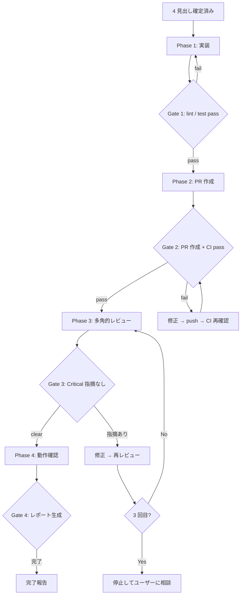

# Feature Delivery

## 概要

`requirements-summary` で確定した 4 見出し（ゴール / 背景 / Out Of Scope / DoD）を入力に、実装 → PR 作成 → 多角的レビュー → 動作確認レポートまでを 1 回の起動で完走させる。各フェーズ間にゲート条件を置き、品質を担保しながら一気通貫で進める。

## 鉄則

- **4 見出しが確定していない状態で実装を始めるな**
- **既存スキルの責務を重複実装するな。呼び出して使え**
- **ゲート条件を満たさずに次フェーズに進むな**
- **マージまで進めるな（責務外。`merge-and-cleanup` に渡せ）**

## 使用場面

- `requirements-summary` で 4 見出しが確定した後、実装から動作確認まで一気に進めたい時
- 「実装して」「一気通貫でやって」「実装から動作確認まで」「フル実装して」と指示された時
- 前提: 4 見出し（ゴール / 背景 / Out Of Scope / DoD）がチャット履歴に存在しユーザー承認済みであること。未確定なら先に `requirements-summary` を実行しろ
- 例外: PR が develop ベースで作成済みかつ CI pass なら Phase 3 から開始してよい（Phase 4 まで進める場合は worktree が準備済みであること）

## フェーズ全体図



## 手順

### Phase 1: 実装しろ

全 Phase は worktree 内で作業する前提。

1. worktree を準備する（`setup-worktree` skill。既に準備済みならスキップ）
2. 確定済みの 4 見出しを入力にし、`orchestrator` の Step 1（分解）と Step 2（実行手段選択）に従ってタスクを分解・実行する。Step 3（レビュー）と Step 4（統合報告）は Phase 3 で実行するためここでは省く
3. テストを先に書け（TDD）

**Gate 1**: 以下が全て pass するまで Phase 2 に進むな。

```bash
sh project_check.sh -cl    # client lint
sh project_check.sh -al    # api lint
cd api && uv run pytest     # api test
cd client && bun run test   # client test（該当テストがある場合）
```

### Phase 2: PR を作成しろ

1. コミットは Conventional Commits（`.claude/rules/common/git-pr.md` に従え）
2. PR タイトルは `type(scope): 日本語説明`
3. PR 本文に 4 見出しを含めろ（レビューアーが要件を把握できるようにする）
4. `gh pr create --base develop`
5. `gh pr view --web` でブラウザに開く

**Gate 2**: PR が作成され、CI が pass するまで Phase 3 に進むな。

```bash
gh pr checks <PR番号> --watch
```

CI fail 時は原因を特定し、修正 → commit → push → `gh pr checks --watch` で CI 再確認しろ。Phase 1 の worktree セットアップやタスク分解からやり直す必要はない。

### Phase 3: 多角的レビューを実行しろ

`orchestrator` スキルの Step 3（観点別レビュー）に従え。

1. orchestrator の基本 5 観点テーブルから選択し、独立 3 観点以上で並列レビューを実行する
2. Critical 指摘は反証 agent（adversarial verify）で誤検知を排除する
3. 真の Critical 指摘があれば修正 → コミット → push → CI 確認 → 再レビュー

**Gate 3**: Critical 指摘が全て解消（修正済み or 誤検知と判定）されるまで Phase 4 に進むな。修正 → 再レビューのループは **最大 3 回**。3 回で解消しなければ停止してユーザーに相談しろ。

### Phase 4: 動作確認レポートを生成しろ

前提: Phase 1 の worktree が存続していること。

1. `worktree-dev-up` で dev server を起動する
2. `verify-screen` スキルの手順に従い、DoD に基づいた業務シナリオを設計・実走・評価・レポート生成する

**Gate 4**: HTML レポートが生成され、ブラウザで開けること。

### 完了報告

全 Phase 完了後、以下のフォーマットで報告しろ。

```markdown
## Feature Delivery 完了報告

### 実装（Phase 1）
- ブランチ: [ブランチ名]
- 主な変更: [箇条書き]

### PR（Phase 2）
- PR URL: [URL]

### レビュー結果（Phase 3）
| 観点 | Critical | Warning | Info |
|---|---|---|---|

### 動作確認（Phase 4）
- レポート: [ファイルパス]
- 総合判定: [✅ / ⚠ / ❌]

### 次のアクション
- `merge-and-cleanup` でマージ・後片付けへ
```

## 検証チェックリスト

- [ ] 前提: 4 見出し（ゴール / 背景 / Out Of Scope / DoD）が確定済み
- [ ] Phase 1: lint / test が全 pass（client test は該当テストがある場合のみ）
- [ ] Phase 2: PR が作成され CI pass
- [ ] Phase 3: 独立 3 観点以上のレビューを実行し、Critical 指摘を全て解消した
- [ ] Phase 4: HTML レポートが `.tmp/verify-screen/` に出力され、ブラウザで開いた
- [ ] 完了報告を所定フォーマットで出した

全項目をチェックできない場合、Feature Delivery は完了していない。未完了の Phase に戻れ。

## よくある言い訳

| 言い訳 | 現実 |
|---|---|
| 「要件は頭の中にあるから 4 見出し不要」 | 4 見出しが確定するまでこのスキルを起動するな。先に `requirements-summary` を実行しろ |
| 「小さい変更だからレビューは 1 観点でいい」 | 小さい変更ほど見落とす。独立 3 観点以上 |
| 「動作確認は目視で十分」 | レポートに残さなければ確認したと言えない |
| 「Gate 条件を緩めて先に進めたい」 | Gate を緩めた分だけ後工程で爆発する |
| 「既存スキルの手順を自分で書き直した方が効率的」 | 重複実装はメンテナンスの地獄。既存スキルを呼べ |

## 危険信号 - 停止

以下に気付いたら即座に作業を止め、該当 Phase に戻れ。

- 4 見出しが確定していないのに実装を始めようとしている（前提未達）
- lint / test を通さずに PR を作ろうとしている（Gate 1 未通過）
- レビュー観点が 3 未満に減っている（Phase 3 の鉄則違反）
- verify-screen を省略して完了報告を書こうとしている（Phase 4 未実行）
- 既存スキルのロジックをコピペで書き始めた（重複実装）
- マージまで進めようとしている（責務外）

## アンチパターン

| ❌ NG | ✅ OK |
|---|---|
| 4 見出し未確定のまま実装開始 | 先に `requirements-summary` を実行して確定させろ |
| Gate 条件未達で次 Phase に進む | Gate を満たすまで現 Phase に留まる |
| レビュー指摘を無視して動作確認に進む | Critical 全解消後に Phase 4 |
| 動作確認なしで完了報告 | verify-screen の HTML レポートを生成してから報告 |
| マージまで一気に進める | PR 作成 + レビュー + 動作確認で止め、merge-and-cleanup に渡す |

## 停止して相談すべき時

質問は 1 セッション 0〜1 回が上限。後から覆せない判断のみ確認しろ。

- 要件の解釈が複数あり、実装方針が大きく分岐する
- DB スキーマ変更を伴い、マイグレーションの方向性が確定できない

## 連携

- 前段スキル: `requirements-summary`（4 見出しの確定。本スキルの起動前に完了していること）
- 内部で使うスキル: `orchestrator` / `setup-worktree` / `worktree-dev-up` / `verify-screen`
- 後続スキル: 完了したら `merge-and-cleanup` に渡せ（マージ・後片付け）
- 関連スキル: `bug-issue-fix`（バグ対応は別フロー）/ `review-merge-cleanup`（レビュー + マージの一体型）

## 結論

要件が確定したら、実装から動作確認まで一気通貫で走らせなければデリバリーにならない。
