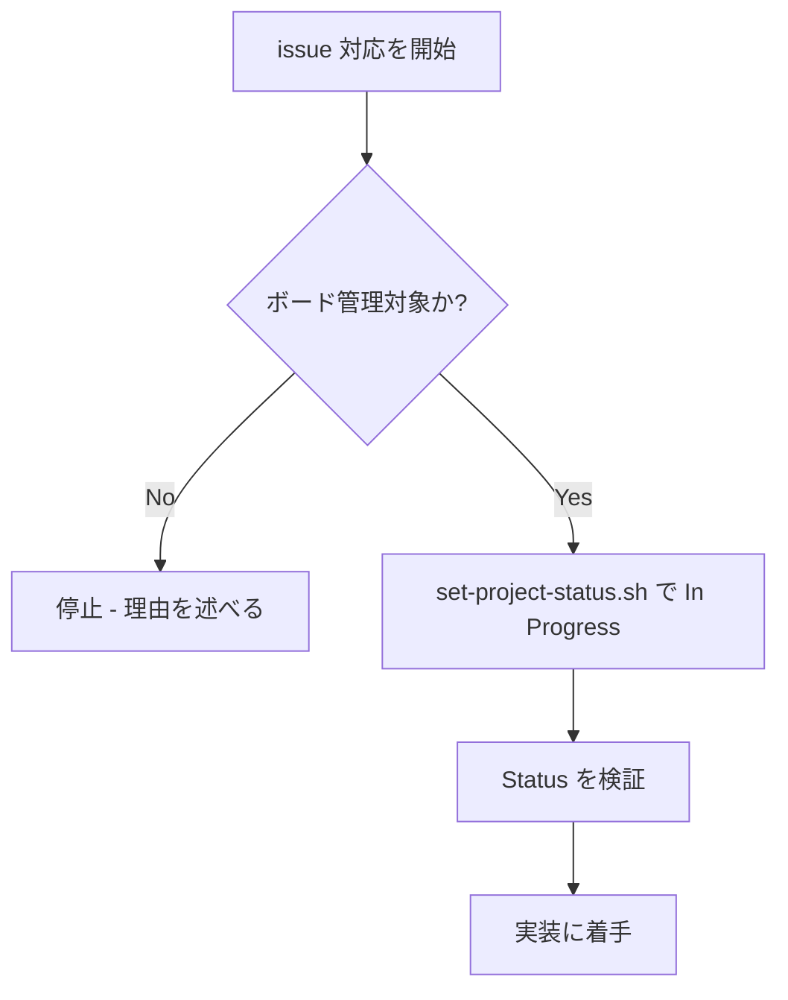

# github-issue-in-progress

GitHub issue に着手する時、**Project #18 の Status を In Progress に移してから作業を始める**。これを全 issue 対応の王道パターンにする。

## 概要

着手したものを Todo のまま放置するな。着手＝ In Progress にする。

## 鉄則

- **着手する前に Status を In Progress にしろ**
- **着手と Status 更新を切り離すな**（実装を始める＝ In Progress にする）

## 使用場面

- GitHub issue の対応を始める時（特定フローに限らず、全 issue 対応で）
- 例外: ボード管理が不要な軽微な作業は対象外（その判断理由を述べろ）

## 対象プロジェクト

| 項目 | 値 |
|---|---|
| owner | `sky-grid-inc`（Organization） |
| repo | `senri-core-system` |
| project number | `18` |
| Status | `Todo` / `In Progress` / `Done` |

## ステータスのライフサイクル

```
issue 作成 ──▶ Todo（github-issue-todo）
                │
   着手 ◀── このスキルの肝 ──▶ In Progress
                │
   issue を Close ──▶ Done（自動・操作不要）
```

- 着手時の `In Progress` は手動。このスキルで行う
- 完了時の `Done` は GitHub 標準ワークフロー（Item closed → Done）で**自動**。Close するだけでよい

## 手順



### Step 1: In Progress にしろ

着手を決めたら、実装に入る前に Status を In Progress にしろ。ボードに無ければ自動で追加される。

```bash
bash .claude/skills/shared/scripts/set-project-status.sh <issue番号> "In Progress"
```

### Step 2: 検証しろ

Status が反映されたか確認しろ（`gh project item-list` はキャッシュ遅延があるため GraphQL で確認しろ）。

```bash
gh api graphql -f owner=sky-grid-inc -f repo=senri-core-system -F num=<issue番号> \
  -f query='query($owner:String!,$repo:String!,$num:Int!){
    repository(owner:$owner,name:$repo){ issue(number:$num){
      projectItems(first:50){ nodes{ project{ number } fieldValueByName(name:"Status"){
        ... on ProjectV2ItemFieldSingleSelectValue { name } } } } } } }' \
  --jq '.data.repository.issue.projectItems.nodes[] | select(.project.number==18) | .fieldValueByName.name'
```

### Step 3: 完了時

実装が終わり issue を Close すれば Status は自動で Done になる。手動操作はするな。

## 検証チェックリスト

- [ ] 着手前に Status を In Progress にした
- [ ] GraphQL で Status = In Progress を確認した
- [ ] 完了時は issue を Close し、Done への自動遷移を確認した

全項目をチェックできない場合、この王道パターンは守れていない。Step 1 に戻れ。

## よくある言い訳

| 言い訳 | 現実 |
|---|---|
| 「小さい修正だからボード更新不要」 | 進捗が見えなくなる。対象なら必ず In Progress にしろ |
| 「実装してから後でまとめてボード直す」 | 後では来ない。着手＝ In Progress |
| 「item-list が空だから載ってない」 | item-list はキャッシュ遅延する。GraphQL で確認しろ |

## 危険信号 - 停止

- Todo のまま実装を始めようとした → 先に In Progress にしろ
- `gh project item-list` の結果だけで判断しようとした → GraphQL で裏取りしろ
- Status の ID をハードコードしようとした → スクリプトが動的解決する。ハードコードするな

## アンチパターン

| ❌ NG | ✅ OK |
|---|---|
| 着手後にまとめてボードを更新 | 着手前に In Progress にする |
| Done を手動で設定 | Close して自動遷移させる |
| option ID をスクリプト外で直書き | `set-project-status.sh` で動的解決 |

## 停止して相談すべき時

質問は 1 セッション 0〜1 回が上限。後から覆せない判断のみ確認しろ。

- Project #18 が存在しない（owner / number が変わった）
- Status の選択肢構成が Todo / In Progress / Done から変わった

## 連携

- 前段スキル: `github-issue-todo`（作成時）
- 後続スキル: なし（完了は issue Close で自動 Done）
- 関連スキル: `github-issue-todo`

## 結論

着手の合図は、In Progress だ。
