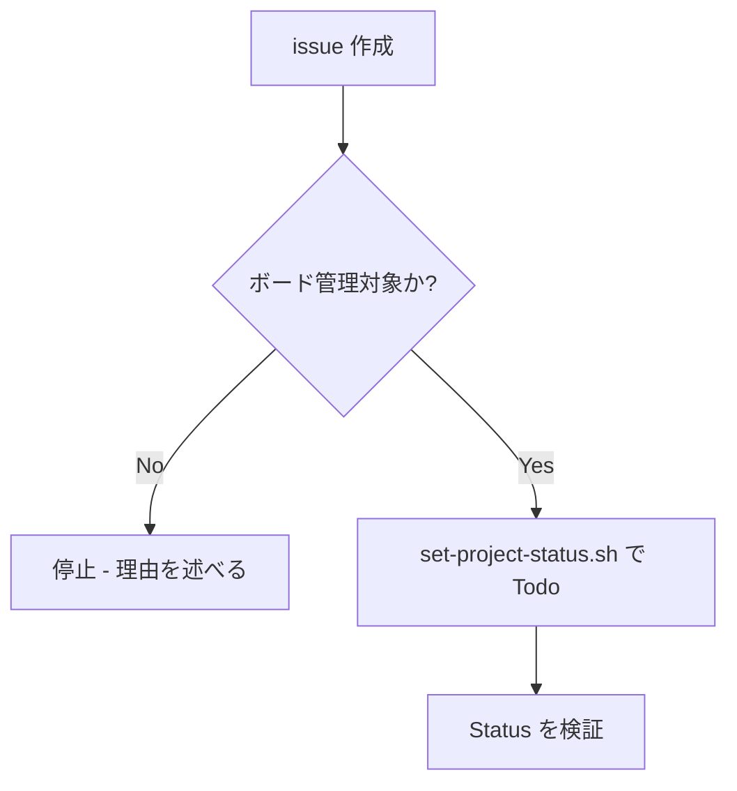

# github-issue-todo

GitHub issue を作成したら、**Project #18 に追加して Status を Todo にする**。起票したものを必ずボードに載せる。

## 概要

新規 issue をボードの起点（Todo）に置く。起票したのにボード外、という状態を作るな。

## 鉄則

- **issue を作成したら Todo に載せろ**
- **option ID をハードコードするな**（スクリプトが動的解決する）

## 使用場面

- GitHub issue を新規作成した直後
- 例外: ボード管理が不要な issue は対象外（その判断理由を述べろ）

## 対象プロジェクト

| 項目 | 値 |
|---|---|
| owner | `sky-grid-inc`（Organization） |
| repo | `senri-core-system` |
| project number | `18` |
| Status | `Todo` / `In Progress` / `Done` |

## 手順



### Step 1: Todo に載せろ

issue を作成したら、ボードに追加して Todo にしろ。

```bash
bash .claude/skills/shared/scripts/set-project-status.sh <issue番号> "Todo"
```

### Step 2: 検証しろ

Status が反映されたか確認しろ（`gh project item-list` はキャッシュ遅延があるため GraphQL で確認しろ）。

```bash
gh api graphql -f owner=sky-grid-inc -f repo=senri-core-system -F num=<issue番号> \
  -f query='query($owner:String!,$repo:String!,$num:Int!){
    repository(owner:$owner,name:$repo){ issue(number:$num){
      projectItems(first:50){ nodes{ project{ number } fieldValueByName(name:"Status"){
        ... on ProjectV2ItemFieldSingleSelectValue { name } } } } } } }' \
  --jq '.data.repository.issue.projectItems.nodes[] | select(.project.number==18) | .fieldValueByName.name'
```

## 検証チェックリスト

- [ ] issue をボードに追加した
- [ ] GraphQL で Status = Todo を確認した

全項目をチェックできない場合、起票はボードに反映できていない。Step 1 に戻れ。

## よくある言い訳

| 言い訳 | 現実 |
|---|---|
| 「後でまとめてボードに載せる」 | 後では来ない。作成時に載せろ |
| 「item-list が空だから載ってない」 | item-list はキャッシュ遅延する。GraphQL で確認しろ |

## 危険信号 - 停止

- option ID をスクリプト外で直書きしようとした → スクリプトが動的解決する
- `gh project item-list` の結果だけで判断しようとした → GraphQL で裏取りしろ

## アンチパターン

| ❌ NG | ✅ OK |
|---|---|
| 作成後にまとめてボード更新 | 作成時に Todo へ載せる |
| option ID を直書き | `set-project-status.sh` で動的解決 |

## 停止して相談すべき時

質問は 1 セッション 0〜1 回が上限。後から覆せない判断のみ確認しろ。

- Project #18 が存在しない（owner / number が変わった）
- Status の選択肢構成が Todo / In Progress / Done から変わった

## 連携

- 前段スキル: なし
- 後続スキル: 着手時は `github-issue-in-progress`
- 関連スキル: `github-issue-in-progress`

## 結論

起票の置き場は、Todo だ。
