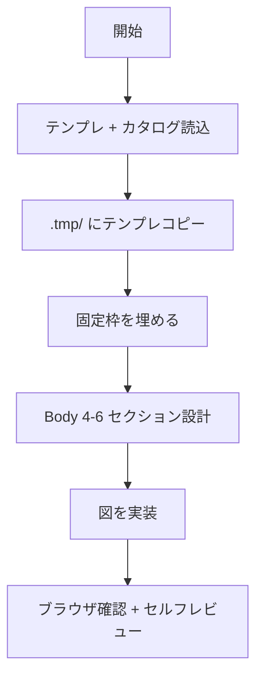

# HTML ドキュメント生成

## 概要

文字ではなく図で伝える HTML 資料を生成する。`document-template.html` を `.tmp/` にコピーして固定枠 + Body 4〜6 セクションを埋める。

## 鉄則

- **絵で伝えろ**（テキストは図の補足）
- **各論点に最適な図を選べ**（型に縛られるな。catalog から番号で選定）
- **字数上限を守れ**（超えたら文章を削るか図に変換）
- **構造型（compare / matrix）は逃げ**（多用するな。1〜2 個まで）

## 使用場面

- ユーザーから「HTML 資料」「資料を作って」「ドキュメントを書いて」「設計書を作って」「まとめて」等と指示があった時
- 例外: `document-template.html` / `document-catalog.html` / `document-demo.html` 自体の編集はメタ作業のため対象外

## 手順



### Step 1: テンプレとカタログを読み込め

```text
Read .claude/skills/html-document/document-template.html
Read .claude/skills/html-document/document-catalog.html
```

迷ったら `document-demo.html` を参照（編集禁止）。

許可ライブラリ:

| ライブラリ | 用途 | CDN |
|---|---|---|
| Mermaid.js 11 | flow / sequence / mindmap / gantt / sankey / ER 等 22 種 | `cdn.jsdelivr.net/npm/mermaid@11` |
| Chart.js 4 | 棒 / 線 / 円 / ドーナツ / レーダー / ゲージ等 18 種 | `cdn.jsdelivr.net/npm/chart.js@4` |

他の外部ライブラリは禁止。CDN は `@latest` 禁止、メジャーバージョン固定（`@11` / `@4`）。

### Step 2: `.tmp/{kebab-title}.html` にテンプレをコピーしろ

`document-template.html` だけ複製しろ。catalog / demo は複製するな。

### Step 3: 固定枠を埋めろ（字数厳守）

| 差し替え対象 | 上限 |
|---|---|
| `<title>` / `.sidebar-title` | 40 字 / 短縮 20 字 |
| `.doc-type` / `<h1>` / `.doc-meta` | タイトル 40 字 |
| Goal の `.preamble-definition` | 1 文 80 字 |
| Background の `li × 3` | 各 60 字 |
| DoD の `li × 3〜5` | 各 60 字 |
| Overview の Mermaid mindmap | ルート 30 字 / 枝 20 字 / 孫 30 字 / 枝 3〜5 個 |

### Step 4: Body セクションを設計しろ（4〜6 個）

1. 資料の論点を 4〜6 個に分解
2. 各論点に最適な図を `document-catalog.html` の番号で選定
3. 構造型（36 compare / 37 matrix）は最大 1〜2 個まで。残りは絵型
4. テンプレ Body の `<section class="type-XXX">` スケルトンを論点数だけ複製
5. `type-XXX` を選んだ番号に応じて命名（例: `type-bar` / `type-flow` / `type-mindmap`）

### Step 5: 図を実装しろ

#### Mermaid 系（catalog 19〜35）

`<pre class="mermaid">` 内に DSL を書け。テーマカラーは template の `runMermaid()` が自動適用する。

```html
<section class="section type-flow" id="section-flow">
  <div class="section-header"><span class="section-number"></span><h2>セクション名</h2></div>
  <div class="fig-frame">
    <pre class="mermaid">
flowchart LR
  A[開始] --> B{判定}
  B -- Yes --> C[完了]
  B -- No --> D[再試行]
    </pre>
  </div>
  <div class="fig-caption">補足</div>
</section>
```

ノード名に DSL キーワード（`mindmap` / `flow` / `sequence` / `chart` / `gauge` 等）を含むなら必ずダブルクォートで囲め（例: `"mindmap"`）。

#### Chart.js 系（catalog 01〜18）

`<canvas>` を置き、`buildCharts()` 内に Chart インスタンス追加コードを書け。`window.__chartInstances.push(...)` で登録すればテーマ切替時に自動再構築される。

```html
<section class="section type-bar" id="section-bar">
  <div class="section-header"><span class="section-number"></span><h2>セクション名</h2></div>
  <div class="fig-frame">
    <div class="chart-wrap"><canvas id="chart-x" role="img" aria-label="説明"></canvas></div>
  </div>
  <div class="fig-caption">補足</div>
</section>
```

```js
window.__chartInstances.push(new Chart(document.getElementById('chart-x'), {
  type: 'bar',
  data: { labels: ['A','B','C'], datasets: [{ label: '系列', data: [10,20,15], backgroundColor: ['#1e3a8a','#5b21b6','#065f46'] }] },
  options: { responsive: true, maintainAspectRatio: false, plugins: { legend: { display: false } } }
}));
```

ゲージは `window.mkGauge('canvas-id', 値, '#色')` ヘルパを使え。

#### CSS 系（catalog 36〜38, 41）

template の既存クラス（`.compare-grid` / `<table>` / 自前 CSS）で書け。新規 CSS 追加は `<style>` 末尾に。

#### SVG 系（catalog 39, 40）

インライン SVG で書け。`viewBox` でレスポンシブ化しろ。

### Step 6: ブラウザ確認 + セルフレビュー

`.tmp/` の HTML を開き、全図がレンダリング / ライト・ダーク両方で読める / CDN 失敗バナーなしを確認しろ。
セルフレビューは「検証チェックリスト」で実施。

## 検証チェックリスト

- [ ] 各 Body セクションに `type-XXX` クラスが付いている
- [ ] セクション数は 4〜6 個
- [ ] 構造型（compare / matrix）は 1〜2 個以内
- [ ] 固定枠の字数上限を守っている
- [ ] 骨組み文言（`資料タイトル` / `中心ゴール` / `要素 A` / `背景 1` 等）が残っていない
- [ ] Mermaid / Chart.js すべて描画されている

全項目をチェックできない場合、資料は完了していない。Step 3 に戻れ。

## よくある言い訳

| 言い訳 | 現実 |
|---|---|
| 「テキストで足りるから図にしない」 | 文字だらけの資料は読まれない。図で伝えろ |
| 「字数オーバーは少しならいい」 | 上限を破ると視覚バランスが崩れる。削るか図に変換 |
| 「構造型でまとめれば速い」 | 逃げ。1〜2 個まで。残りは絵型で表現しろ |

## 危険信号 - 停止

以下に気付いたら即座に作業を止め、Step 1 に戻れ。

- `type-XXX` なしの `<section>` を書こうとした → 警告バーが出る。必ずクラス付与
- `document-demo.html` を編集 / コピー元にしようとした → 完成見本は参照のみ
- セクション数を 7 以上にしようとした → 4〜6 に絞れ
- Mermaid / Chart.js 以外の外部ライブラリを使おうとした → 禁止

## アンチパターン

| ❌ NG | ✅ OK |
|---|---|
| `type-*` クラスなしの `<section>` | `type-XXX` を必ず付与 |
| 図セクション外で自由な `<p>` / `<ul>` / `<div>` | 図セクション内に収める |
| CDN を `@latest` で読み込み | メジャーバージョン固定（`@11` / `@4`） |
| 構造型（compare / matrix）ばかり | 絵型中心、構造型は 1〜2 個まで |
| `document-demo.html` を編集 / コピー元 | `document-template.html` をコピー、demo は参照のみ |

## 停止して相談すべき時

質問は 1 セッション 0〜1 回が上限。後から覆せない判断のみ確認しろ。

- 論点が 7 個以上に分解され、4〜6 セクションに収まらない（資料を分割すべきか要確認）
- 必要な図が catalog 42 種に存在しない（許可ライブラリ拡張の判断が必要）

## 連携

- 前段スキル: なし
- 後続スキル: なし
- 関連スキル: なし

## 結論

文字だらけの資料は、読まれない。
