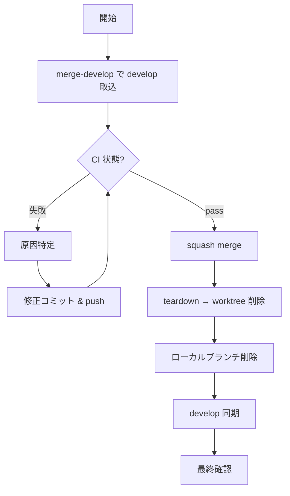

# PR マージと整理

## 概要

PR のマージと片付けを 1 フローで完走させる。
develop 取込 → CI 待ち → squash merge → worktree teardown + 削除 → ローカルブランチ削除 → develop 同期。

## 鉄則

- **CI が全 pass する前にマージするな**
- **マージ後に worktree / ローカルブランチを残すな**
- **`gh pr merge --delete-branch` は使うな**（worktree 環境でエラーになる）
- **他 session の worktree を消すな**（マージ対象の feature ブランチに紐づく worktree のみ消せ。他 session 破壊は致命的）

## 使用場面

- PR が approve されて CI 待ちに入った時
- ユーザーから「マージしておいて」「片付けて」と指示があった時
- ドラフト PR / CI 失敗中の PR も対象（CI 失敗時は修正コミットを積んでから継続）

## 手順



### Step 1: develop の最新を取り込め

`merge-develop` スキルを発火し、feature ブランチに `origin/develop` の最新を取り込め。
取込後の push まで完走させてから Step 2 へ進め。

### Step 2: CI 完走を待て

```bash
gh pr checks <PR番号> --watch
```

全 pass するまで待て。失敗したら次の手順を踏め。

- 失敗ジョブのログを `gh run view <run-id> --log-failed` で確認しろ
- 原因を特定し、修正コミットを積んで push しろ
- CI が再実行されるまで待ち、`gh pr checks <PR番号> --watch` で再確認しろ
- 修正不能な失敗（外部要因・依存関係の破壊変更等）に当たった時のみ Step 2 を抜けて報告しろ

### Step 3: squash merge しろ

```bash
gh pr merge <PR番号> --squash
```

`--delete-branch` は worktree 環境でエラーになるため付けるな。

### Step 4: worktree を teardown して削除しろ

マージ対象の feature ブランチに紐づく自分の worktree（`.claude/worktrees/<worktree名>`）**のみ** 対象にしろ。
他 session が使用中の worktree を間違って消すと、そのセッションが破壊される（致命的）。
実行前に `git worktree list` で対象を必ず確認しろ。

自分の worktree が存在しない場合（feature ブランチのみで開発）は teardown も削除も両方スキップしろ。

存在する場合は、メイン worktree（リポジトリ直下）から実行しろ。
削除対象 `.claude/worktrees/<worktree名>` の中で実行すると、
削除自体は成功するが cwd が消えて以降のコマンドが破綻する。

**teardown を先に実行しろ**。`git worktree remove` は WorktreeRemove hook を発火させないため
docker stack が自動で落ちない。さらに先に worktree を消すと `.env` が失われ `teardown.sh` が
port / project を解決できなくなる。よって順序は teardown → remove に固定する。
`teardown.sh` は `senri-wt-<slug>` project にスコープし、その worktree の
container / volume(DB) / network / 自前 image のみ削除する（他 session / main / 共有 image には触れない）。

```bash
# 1. docker teardown (この worktree 分のみ)
bash .claude/skills/setup-worktree/teardown.sh .claude/worktrees/<worktree名>

# 2. worktree 削除
git worktree remove .claude/worktrees/<worktree名>
```

### Step 5: develop に切り替えて feature ブランチを削除しろ

自分が居るブランチは `-D` で削除できないため、先に develop へ移動しろ。
squash merge は元コミットと別ハッシュを develop に積むため、
ローカル feature ブランチは未マージ判定になり `-d` ではエラーになる。
「PR が実際に merged か」を事実確認したうえで `-D` を使え
（未マージブランチを誤って強制削除しないため）。

```bash
# 1. develop に切り替え
git switch develop

# 2. PR が MERGED であることを確認
gh pr view <PR番号> --json state,mergedAt
#   state: "MERGED" / mergedAt が null でないこと

# 3. 確認できたら強制削除
git branch -D <ブランチ名>
```

### Step 6: develop を同期しろ

```bash
git pull origin develop
```

Step 5 で develop に切り替え済みのため、これで develop 自体が origin/develop の最新に追従する。

### Step 7: 最終確認

```bash
git worktree list
git branch
```

対象の worktree / ブランチが残っていないことを確認しろ。

## 検証チェックリスト

- [ ] PR が merged 状態
- [ ] `.claude/worktrees/<worktree名>` が削除済み
- [ ] `docker ps` / `docker images` に対象の `senri-wt-<slug>-*` が残っていない
- [ ] ローカル `<ブランチ名>` が `git branch` の出力に存在しない
- [ ] develop が origin/develop と同一コミット
- [ ] `git worktree list` の出力に対象が残っていない

全項目をチェックできない場合、片付けは完了していない。Step 1 に戻れ。

## よくある言い訳

以下の思考が浮かんだら、それは間違い。

| 言い訳 | 現実 |
|---|---|
| 「CI 残り 1 件赤いけど無関係そう」 | 無関係判定は禁止。原因を特定して修正コミットを積め |
| 「CI 失敗したから一旦停止して報告」 | 修正可能な失敗なら修正コミット → 再 push → 再確認まで進めろ |
| 「`--delete-branch` 付ければ一発で済む」 | worktree 環境では失敗する。手動削除しろ |
| 「worktree は後で消せばいい」 | 「後で」は来ない。今消せ |
| 「develop 同期は次の作業時にやる」 | この場で同期しろ。次の起点を揃える |

## 危険信号 - 停止

以下に気付いたら即座に作業を止め、Step 1 に戻れ。

- CI 一部 fail を「無関係だから」と判断しかけた → 原因を特定して修正コミットを積め
- CI 失敗で即座に手を止めようとした → 修正可能なら継続が原則。修正不能と判断した時のみ停止
- `teardown.sh` を呼ばず `git worktree remove` だけ打とうとした → docker stack が孤立する。先に teardown しろ
- 削除対象 worktree の中から `git worktree remove` を打とうとした → 削除は成功するが cwd が消えて後続が破綻。メイン worktree に戻ってから実行
- マージ対象と異なる worktree 名を消そうとした → 他 session 破壊の致命的リスク。即座に停止し `git worktree list` でマージ対象の worktree 名を再確認
- `gh pr view` で merged 確認せずに `-D` を打とうとした → 未マージブランチの誤削除リスク。先に確認
- `git branch -D` でも削除に失敗 → squash 反映が origin に届いていない兆候。`git fetch` 後に再試行
- develop 同期せずに完了宣言しかけた → 起点を揃えるまで完了するな

## アンチパターン

| ❌ NG | ✅ OK |
|---|---|
| `gh pr merge --squash --delete-branch` | `gh pr merge <PR番号> --squash` のみ。削除は手動 |
| 未確認のまま `git branch -D` | `gh pr view` で merged を確認してから `-D` |
| `git branch -d <branch>` で削除 | squash merge は `-d` で未マージ判定エラー。merged 確認後に `-D` |
| `git worktree remove` だけで docker を残す | `teardown.sh` → `git worktree remove` の順で docker ごと消す |
| worktree を残したまま次作業へ | 削除して `git worktree list` で確認 |
| develop 同期前に終了 | `git pull origin develop` まで完走 |

## 停止して相談すべき時

質問は 1 セッション 0〜1 回が上限。後から覆せない判断のみ確認しろ。

- CI 失敗が修正不能（外部要因 / 依存の破壊変更 / 自分の修正範囲を超える）
- worktree 削除が `--force` でしか通らない（未コミット変更の疑い）

## 連携

- 前段スキル: なし
- 後続スキル: なし
- 関連スキル: `merge-develop`（Step 1 から呼び出す。マージ前に develop を取り込む）

## 結論

worktree とブランチを残したマージは、未完了だ。
