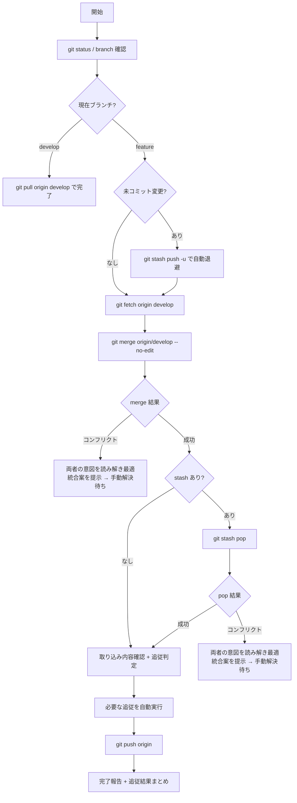

# Merge Develop

## 概要

現在の作業ブランチへ `origin/develop` の最新を取り込み、追従対応を判定して push まで完走する。
未コミット変更は自動 stash で退避し、merge 完了後に pop で復元する。ユーザー確認は仰がない。

## 鉄則

- **ユーザー判断は仰ぐな**（未コミット変更も push 可否も自動で決めろ）
- **未コミット変更があれば自動 stash → merge → pop で退避復元しろ**
- **取り込んだ develop 変更を確認し、自分の作業への追従要否を判定しろ**（merge して終わりにするな）
- **コンフリクトは機械的に自動解決するな**（`--theirs` / `--ours` の一括は禁止）
- **コンフリクト時は自分と相手の双方の意図を尊重し、最適統合案を考え抜いてユーザーに提示しろ**（一方を捨てる前に必ず両側の理由を読み解け）
- **現在ブランチが develop なら develop 自体を最新化して終われ**（自分自身に merge するな）

## 使用場面

- 別セッションで先にマージされた PR の変更を、自分の作業中ブランチへ反映する時
- レビュー前に develop 最新と整合させたい時
- `merge-and-cleanup` の Step 1 から呼び出される時（PR マージ前の develop 取込）
- 例外: PR マージ後の片付け（worktree / ブランチ削除）は `merge-and-cleanup` を使え。本 skill は対象外

## 手順



### Step 1: 事前チェックを実施しろ

```bash
git status --porcelain
git branch --show-current
```

- 現在ブランチが `develop` → `git pull origin develop` で develop 自体を最新化して完了。merge / stash / push ステップはスキップしろ
- 未コミット変更あり → Step 2 へ進む前に下記コマンドで自動退避しろ。ユーザー確認は不要

```bash
git stash push -u -m "merge-develop auto-stash"
```

stash 実行有無を内部状態として保持し、Step 4 で pop に使え。

### Step 2: develop の最新を取得しろ

```bash
git fetch origin develop
```

失敗時はエラー内容を報告して中断しろ（ネットワーク / 権限 / リポジトリ設定の問題）。Step 1 で stash した場合は中断前に `git stash pop` で必ず復元しろ。

### Step 3: merge を実行しろ

```bash
git merge origin/develop --no-edit
```

- 成功 → Step 4 へ
- コンフリクト → 下記「コンフリクト解消の作法」に従え

#### コンフリクト解消の作法

機械的に `--theirs` / `--ours` で一括解決するな。以下の順で対応しろ。

1. **両者の意図を読み解け**
   - 自分側 (`HEAD`): 何を達成しようとしていたか、どの要件を満たすコードか
   - 相手側 (`origin/develop`): どの PR で / 何の目的で / どの要件を満たすコードか（`git log -p origin/develop -- <ファイル>` で確認）
2. **最適統合案を考え抜け**
   - 両側の意図を満たす統合コードを設計しろ
   - 一方を捨てる前に「なぜ捨てるか」「捨てると何が壊れるか」を明文化しろ
3. **統合案をユーザーに提示しろ**
   - コンフリクトファイル一覧
   - ファイルごとに「自分側の意図」「相手側の意図」「提案する統合案」「捨てる場合の根拠」
4. **適用はユーザー承認後**
   - 承認が出たら `git add` → `git commit`（merge コミット）まで完走

### Step 4: stash した場合は pop で復元しろ

Step 1 で stash した場合のみ実行しろ。

```bash
git stash pop
```

- 成功 → Step 5 へ
- コンフリクト → Step 3 と同じ「コンフリクト解消の作法」に従え。stash 側の変更（=作業中の変更）と develop 取込側の変更の双方を尊重して統合案を提示しろ。`git stash drop` で stash を捨てる選択もありうるが、捨てる前に必ず内容と捨てる根拠をユーザーに提示しろ

### Step 5: 取り込んだ変更を確認し追従しろ

merge / pop が完了したら、取り込んだ変更を機械判定し、追従が必要な対応を実行しろ。

```bash
git log --oneline ORIG_HEAD..HEAD
git diff --name-status ORIG_HEAD..HEAD
```

カテゴリ別の判定と対応:

| カテゴリ | 検出パス | 自動対応 |
|---|---|---|
| Frontend 依存 | `client/package.json` / `client/bun.lock` | `cd client && bun install` を実行 |
| Backend 依存 | `api/pyproject.toml` / `api/uv.lock` | `sh project_check.sh -ar` を実行 |
| Prisma スキーマ | `client/prisma/schema.prisma` | `cd client && bun run generate-prisma` を実行 |
| OpenAPI 影響 | `api/src/**/endpoints/**/*.py` / `client/openapi.json` | `cd client && bun run generate-client` を実行 |
| DB マイグレーション | `api/alembic/versions/` | 報告のみ（環境影響大）。適用は `docker compose exec -T api uv run alembic upgrade head` を完了報告で案内。`sh project_check.sh -ad` は破壊的（DB 初期化+Seed）なので勝手に打つな |
| Lint / 設定 | `biome.json` / `eslint.config.*` / `api/pyproject.toml`(lint) | `sh project_check.sh -cl` / `-al` を実行 |
| プロジェクトルール | `CLAUDE.md` / `.claude/rules/**` | 報告のみ。要点を完了報告で要約 |
| 自分の作業中ファイル | `git diff --name-only HEAD~..HEAD` と重複 | 報告のみ。論理衝突の可能性を完了報告で提示 |

自動対応で生成物 / ロック / 型ファイルが変更された場合は `git status` で表示し、コミット要否を完了報告に含めろ（自動コミットはするな）。
自動対応コマンドが失敗した場合は中断・報告。stash 残しに注意（Step 1 で stash した場合は pop 済みのはずだが、再 stash した場合は必ず復元）。

### Step 6: push しろ

ユーザー確認は不要。Step 5 まで完走したら push しろ。

```bash
git push origin <current-branch>
```

push 失敗時はエラー内容を報告して中断しろ（拒否された場合は `--force` 系を勝手に使うな。`停止して相談すべき時` を参照）。

### Step 7: 完了報告しろ

merge / stash pop / push の結果と、Step 5 で判定した追従内容を以下の構造でまとめろ。

```text
## merge-develop 完了報告

- 取り込みコミット数: N 件 / 変更ファイル数: M 件
- stash: なし / 自動退避→復元
- コンフリクト: なし / 解消済み（M 件）
- 自動追従: <実行コマンド一覧>
- 手動確認推奨: <CLAUDE.md ルール変更の要点 / 自分のファイルへの論理衝突可能性 / マイグレーション要否>
- push: 成功 / 失敗（理由）
- 次に確認: PR ページの CI / レビュア通知
```

## 検証チェックリスト

- [ ] `git status` がクリーン（stash 退避→pop 復元で元の状態に戻っている。または最初からクリーンだった）
- [ ] `git log --oneline origin/develop..HEAD` の差分が想定通り
- [ ] merge / stash pop でコンフリクトがあった場合、両者の意図を尊重した統合案を提示し、全て手動解決済み（`git status` に `Unmerged paths` なし）
- [ ] 取り込んだ変更のカテゴリ判定を実施し、自動追従コマンドを実行・結果を完了報告に含めた
- [ ] CLAUDE.md / プロジェクトルール / 自分のファイルへの論理衝突可能性を完了報告で提示
- [ ] `git push` が成功している（拒否された場合のみ中断・報告）
- [ ] 完了報告を出した

全項目をチェックできない場合、merge は完了していない。Step 1 に戻れ。

## よくある言い訳

| 言い訳 | 現実 |
|---|---|
| 「未コミット変更 / push 可否はユーザーに確認しよう」 | 確認不要。stash → merge → pop → push まで自動で完走しろ |
| 「コンフリクトは相手側を全部受ければ早い」 | 両者の意図を読み解け。捨てる前に統合案を考えろ |
| 「merge できたから完了」 | 取り込み内容の追従要否を判定するまで完了するな |
| 「stash したまま完了報告」 | pop まで完走しろ。stash 残しは作業消失リスク |

## 危険信号 - 停止

以下に気付いたら即座に作業を止め、Step 1 に戻れ。

- ユーザーに確認しようとしている → 自動化方針を破るな。stash / push は黙って実行しろ
- コンフリクトで `--theirs` / `--ours` で一括解決、または一方を捨てようとしている → 両者の意図を読み解いて統合案を出せ
- merge 成功で push に直行しかけた → Step 5 の追従判定をスキップするな
- push が拒否され `--force` を打とうとした → 破壊的操作。`停止して相談すべき時` に該当

## アンチパターン

| ❌ NG | ✅ OK |
|---|---|
| 未コミット変更 / push 可否でユーザー確認 | 自動 stash → merge → pop → push まで黙って完走 |
| コンフリクトを `--theirs` / `--ours` の二択で解決 | 両者の意図を読み解き統合案を提示し、ユーザー承認後に解決 |
| merge 成功 = 完了として push に直行 | Step 5 の追従判定 → 必要な追従コマンド実行 → push |
| 拒否された push に `--force` を勝手に実行 | 中断して原因報告。破壊的対処はユーザー判断 |

## 停止して相談すべき時

質問は 1 セッション 0〜1 回が上限。後から覆せない破壊的判断のみ確認しろ。

- merge / stash pop コンフリクトで、両者の意図を尊重した統合案が複数あり、選択にビジネス文脈が必要
- 自動追従コマンドが失敗し、原因が環境依存で本 skill の責務を超える
- マイグレーション追加の自動適用判断（`alembic upgrade head` の自動実行 / `-ad` での破壊的初期化は要確認）
- push が拒否され `--force` 系の対処が必要に見える（破壊的操作の前に必ず確認）

## 連携

- 前段スキル: なし
- 後続スキル: なし
- 関連スキル: `merge-and-cleanup`（PR マージ前段として本 skill を呼ぶ側 + マージ後の worktree / ブランチ片付け担当）

## 結論

develop 取込なしのマージは、CI 失敗の温床だ。
取り込みっぱなしで追従しないマージは、後続作業の地雷だ。
