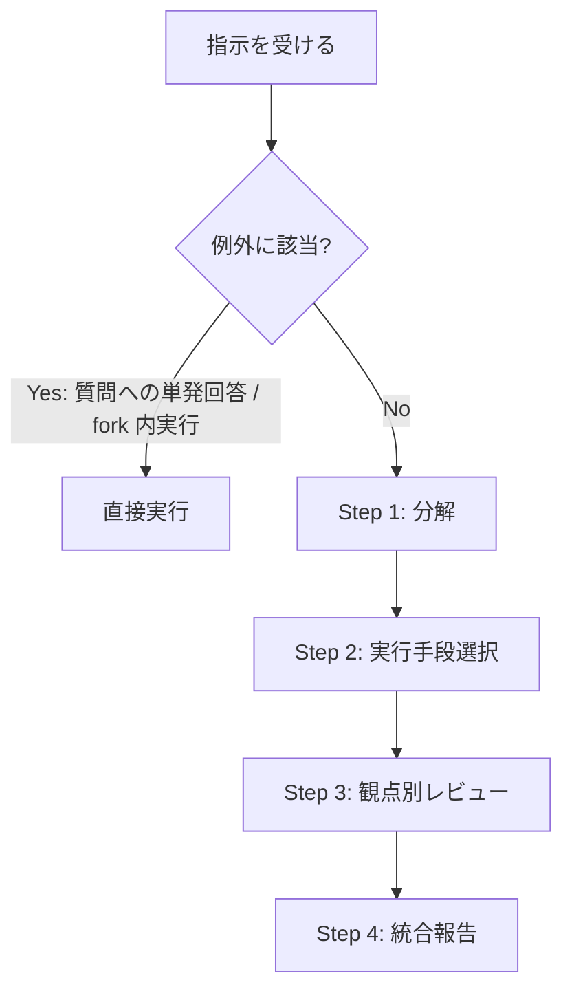

# 司令塔オーケストレーション

## 概要

タスクを分解し、fork agent と Workflow に委譲して並列実行しろ。レビューは独立した観点を並列で走らせ、Critical 指摘は反証してから報告しろ。

行動原則（4 点固定・確証ベース）は `action-principles.md`、見直しは `principles.md`「3 回見直しの原則」に従え。

## 鉄則

- **単一コンテキストで全部やるな。分解して委譲しろ**
- **コード変更を伴う作業は、独立した 3 観点以上の並列レビューを必ず通せ**
- **fork へのプロンプトはファイルパス・行番号・変更内容まで具体化しろ**（「いい感じに直せ」禁止）
- **全 fork の結果を統合し、構造化レポートで報告しろ**

## 使用場面

- ユーザーが司令塔モード / 並列オーケストレーション / 多角的レビューを明示的に求めた時
- 例外: コード変更を伴わない質問への単発回答は直接答えてよい（レビュー依頼は本スキルの対象）
- 例外: 自分が fork agent として実行中なら、委譲せず直接実行しろ（re-delegate 禁止）
- 例外に該当する場合、本スキルの鉄則・手順・検証チェックリストは適用外

## 手順



### Step 1: 分解しろ

- 着手前の 4 点固定（ゴール / 背景 / やらないこと / DoD）は `action-principles.md` に従え
- ファイル競合・依存のないタスクを並列単位に、前段の結果が要るタスクを順序実行に分けろ
- 1 fork = 1 責務。大きすぎるタスクは更に割れ

### Step 2: 実行手段を選べ

| 手段 | 使う場面 |
|---|---|
| agent 並列 | 2〜4 個の独立タスク。実装は `subagent_type` 省略の fork（親 context 継承）、調査・読取専用は `subagent_type: "Explore"` |
| Workflow ツール | 独立タスク 5 件以上 / 同処理を異なる対象に N 回 / 観点 3 角度以上の多面調査 / 結果を JSON Schema で構造化して受け取りたい時 |
| worktree | コード変更は worktree 内で行え（`prohibitions.md`「Git 関連」）。並列度 1 はパターン A（親が worktree を作り fork に継承）、複数 fork の並列書き込みはパターン B（`setup-worktree` とセット）。`fork-agent-worktree.md` に従え |

- 並列 fork は 1 メッセージに複数 Agent 呼び出しをまとめろ
- 委譲できるものから先に dispatch しろ（fork は背景実行。先に投げた分だけ idle が消える）
- 前段 fork の結果を後段に渡す時は、要約してプロンプトに含めろ

### Step 3: 観点別レビューを並列実行しろ

コード変更を伴う作業の完了後は必須。各レビュアーは他の結果を知らない独立 agent として起動しろ。実行手段は Step 2 の表で選べ（5 観点以上 → Workflow、3〜4 観点 → agent 並列）。

基本 5 観点（タスクに合わない観点は入れ替えてよい。ただし独立 3 観点未満にするな）:

| 観点 | 見るもの |
|---|---|
| 正確性 | ロジックバグ、エッジケース、境界値、null 参照 |
| セキュリティ | インジェクション、認証漏れ、OWASP Top 10 |
| パフォーマンス | N+1 クエリ、不要ループ、メモリ効率 |
| 可読性・保守性 | 命名、DRY、関心の分離 |
| ビジネスロジック整合性 | 仕様との一致、既存機能への退行 |

タスク種別の追加観点:

| タスク種別 | 追加観点 |
|---|---|
| 全般 | `prohibitions.md` 違反チェック |
| スキル作成 | `skill-creator` 準拠 |
| DB 変更 | マイグレーション安全性、データ整合性 |
| API 変更 | OpenAPI スキーマ整合性、ロール分離、URL 規約 |
| フロントエンド | 階層依存方向（`frontend/architecture.md`）、コンポーネント粒度、アクセシビリティ |

Critical 指摘は鵜呑みにするな。採用前に反証 agent（adversarial verify）で誤検知を排除しろ。

agent 並列の例:

```text
Agent({ description: "正確性レビュー", prompt: "<差分> を正確性（エッジケース・境界値）の観点でレビューしろ。severity 付きで指摘を返せ" })
// 残りの観点も同形で同一メッセージに並べろ
// Critical 指摘は「この指摘を反証しろ。本当にバグか?」の agent で検証してから採用しろ
```

### Step 4: 統合して報告しろ

全 fork・Workflow の結果を統合し、このフォーマットで報告しろ。

```markdown
## 実行結果

### 完了タスク

- [タスク名]: [結果の要約]

### レビュー結果

| 観点 | Critical | Warning | Info |
|---|---|---|---|

### Critical 指摘（反証済み）

- [指摘内容] — [反証結果: 真 or 誤検知]

### 対応が必要な項目

1. [具体的な対応内容]
```

## 検証チェックリスト

- [ ] 並列実行可能な単位に分解した
- [ ] コード変更を伴う作業に、独立 3 観点以上のレビューを並列実行した
- [ ] Critical 指摘を反証チェックしてから報告に載せた
- [ ] 全結果を統合レポートで報告した

タスクの性質上該当しない項目は N/A としてチェック済み扱いにしろ。それ以外で全項目をチェックできない場合、オーケストレーションは完了していない。Step 1 に戻れ。

## よくある言い訳

| 言い訳 | 現実 |
|---|---|
| 「実装が小さいからレビューは 1 観点でいい」 | 単一視点は見落とす。コード変更があるなら独立 3 観点以上 |
| 「agent を起動するより自分でやる方が速い」 | 速さより品質。委譲は独立検証とコンテキスト節約を兼ねる |
| 「Critical 指摘はそのまま報告すればいい」 | 反証なしの Critical は誤検知が混ざる。adversarial verify を通せ |

## 危険信号 - 停止

以下に気付いたら即座に作業を止め、Step 1 に戻れ。

- fork へのプロンプトが曖昧になっている（「いい感じに直せ」）
- レビューの独立観点が 3 未満に減っている
- 同じ worktree に複数 fork で並列書き込みしようとしている
- 全 agent が失敗した（全結果 null）→ ユーザーに報告して停止しろ

## アンチパターン

| ❌ NG | ✅ OK |
|---|---|
| Agent tool に `isolation: "worktree"` を指定 | パターン A / B（`fork-agent-worktree.md`） |
| 調査・読取に general-purpose を使う | `subagent_type: "Explore"` で軽量化 |
| agent の結果を個別に逐次報告 | Step 4 の統合レポートで一括報告 |

## 停止して相談すべき時

質問は 1 セッション 0〜1 回が上限。後から覆せない判断のみ確認しろ。

- タスクの分解方針が複数あり、どちらもリスクが同等（ユーザー判断が必要）

## 連携

- 前段スキル: `requirements-summary`（業務要件の整理が必要な場合）
- 後続スキル: `commit-commands:commit-push-pr`（実装完了後の PR 作成）
- 関連スキル: `setup-worktree` / `verify-screen` / `code-review:code-review`（単一視点の詳細レビュー。orchestrator は多角的並列レビュー）

## 結論

独立した観点の並列検証がなければ、レビューにならない。
