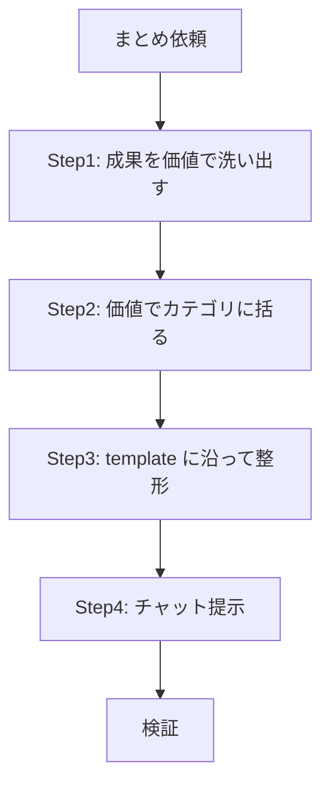

# 成果サマリ提示

## 概要

実装・変更で実現したことを「何ができるようになったか」だけで提示する。技術詳細ではなくユーザー価値で語れ。

## 鉄則

- **ユーザー価値で語れ（技術詳細を書くな）**
- **1 行＝超短文（体言止め／短い動詞）**
- **1 行に複数の事柄を詰め込むな**
- **ファイル名・関数名・API 名など実装語を出すな**
- **結果だけ書け（条件・理由・経緯を書くな）**
- **チャット提示のみ。ファイル生成するな**

## 使用場面

- ユーザーから「できるようになったことまとめて」「成果まとめて」「変更点まとめて」と指示があった時
- 直近の実装・変更の価値を一目で伝えたい時
- 例外: 技術的な作業ログ・PR 本文の自動生成は対象外。チャット提示専用

## 手順

### Step 1: 成果を「価値」で洗い出せ

会話履歴・差分から「ユーザーが何をできるようになったか」を拾え。技術変更を価値に翻訳しろ（例: 「404 を返す endpoint を削除」→「押すと失敗するボタンが消えた」）。

### Step 2: 価値でカテゴリに括れ

カテゴリは「できること・価値」で括れ。技術領域（API / DB / UI 等）で括るな。目安はカテゴリ 3〜6 個 / 各カテゴリの子項目 2〜5 個。

### Step 3: template に沿って整形しろ

[`template.md`](template.md) を読み、フォーマットへ落とせ。粒度に迷ったら [`sample.md`](sample.md) を参照しろ。

| 要素 | フォーマット |
|---|---|
| 見出し | `## 今回できるようになったこと`（1 つだけ） |
| カテゴリ（親） | `- **…**`（太字、価値で括る） |
| 項目（子） | 半角 2 スペースでインデントした `  - …`（1 行＝超短文） |

### Step 4: チャットに提示しろ

整形した本文を 1 回のチャット投稿で完結させろ。ファイルに書き出すな。

## 内容ルール

- カテゴリは「できること・価値」で括る（技術領域では括らない）
- 1 行は最短に削る（修飾・前置きを省く）
- 専門用語は避ける。必要なら括弧で平易に補足（例: 失敗(404)）
- 条件・理由・経緯は書かず、結果だけ書く

## 検証チェックリスト

- [ ] 見出しは 1 つだけ
- [ ] カテゴリは太字の親項目（`- **…**`）で価値を表している
- [ ] 子項目は半角 2 スペースでインデントしている
- [ ] 子項目は 1 行＝超短文（体言止め／短い動詞）
- [ ] カテゴリを技術領域でなく「できること・価値」で括った
- [ ] ファイル名・関数名・API 名など実装語が混ざっていない
- [ ] 1 行に複数の事柄を詰め込んでいない
- [ ] 条件・理由・経緯を書かず結果だけにした
- [ ] カテゴリ 3〜6 個 / 各カテゴリの子項目 2〜5 個に収まっている
- [ ] チャット提示のみで、ファイルへ書き出していない

全項目をチェックできない場合、提示は完了していない。Step 1 に戻れ。

## よくある言い訳

| 言い訳 | 現実 |
|---|---|
| 「技術名を出した方が正確」 | 読み手は価値を知りたい。実装語は読まれない |
| 「経緯も書けば親切」 | 経緯は冗長。結果だけ書け |
| 「1 行にまとめれば短い」 | 詰め込みは読めない。1 行 1 事柄に割れ |
| 「カテゴリは API / 画面で分けると整う」 | 技術領域での分類は価値が伝わらない。価値で括れ |

## 危険信号 - 停止

以下に気付いたら即座に止め、Step 2 に戻れ。

- 子項目が 1 行に収まらず説明文になり始めた → 削れ
- ファイル名・関数名・API 名を書こうとした → 価値に翻訳しろ
- カテゴリを技術領域で括り始めた → 価値で括り直せ
- 報告を `.tmp/` / `docs/` に書き出そうとした → チャット提示のみ

## アンチパターン

| ❌ NG | ✅ OK |
|---|---|
| 1 行に複数の事柄を詰め込む | 1 行 1 事柄に割る |
| ファイル名・関数名・API 名を出す | 価値に翻訳して書く |
| 技術領域（API / DB / UI）でカテゴリを括る | できること・価値でカテゴリを括る |
| 条件・理由・経緯を書く | 結果だけ書く |
| 本文を `.tmp/` / `docs/` に書き出す | チャット提示のみ |

## 停止して相談すべき時

質問は 1 セッション 0〜1 回が上限。後から覆せない判断のみ確認しろ。

- まとめ対象（どの変更を「今回」とするか）が会話履歴から特定できない

## 連携

- 前段スキル: なし
- 後続スキル: なし
- 関連スキル: `session-summary`（作業ログ・PR 状態の報告はこちら）

## 結論

成果は、価値で語らなければ伝わらない。
