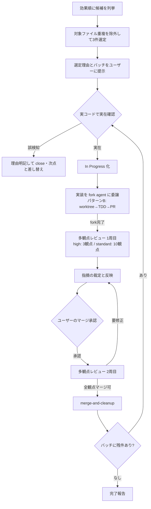

# リファクタチケット対応サイクル

## 概要

1回の実行で相互にコンフリクトしないリファクタ/改善チケット3件をバッチ選定し、各件を「In Progress → 実装(fork agent に委譲) → PR → 多観点レビュー（モデル tier に応じて3〜10観点） → 承認後マージ」のサイクルで完走させる。

自分は**司令塔**としてオーケストレーション（選定・指揮・裁定・マージ）に徹し、**実装はエージェントドリブンで fork agent に委譲**する（`fork-agent-worktree.md` パターンB）。レビューなしマージと環境分離なし実装を排除する。

## 鉄則

- **エージェントドリブンで進めろ**（実装は fork agent に委譲。司令塔は実装を単一コンテキストで抱えるな。コンテキスト逼迫を避け、品質ゲートの指揮に集中しろ）
- **1つの issue につき同時5体まで**（1 issue に対して同時起動する fork / 調査 / レビュー agent は最大5体。コンテキストと環境を逼迫させない上限）
- **対象ファイル・ドメインが重複するチケットを同じバッチに選ぶな**（コンフリクト回避）
- **実コードで問題の実在を確認しろ**（自動診断由来の issue は行番号がズレている前提。誤検知なら理由明記して close = 完了扱い）
- **マージはモデル tier に応じた規定観点数のレビューを通してから**（→「レビュー観点のモデル別設定」参照）
- **ユーザーのマージ承認なしにマージするな**

## 使用場面

- ユーザーが「効果が高いリファクタチケットを選んで対応して」と依頼した時
- Project #18 の Todo からリファクタ/改善チケットに着手する時
- 例外: bug ラベル issue は `bug-issue-fix` を使え

## レビュー観点のモデル別設定

実行モデルの精度に応じてレビューの深度を変える。高精度モデルは少ない観点で十分な品質を担保できるが、精度が劣るモデルは観点を増やして網羅性で補う。

### 判定基準

自分のモデルは system prompt の `You are powered by the model named ...` で判定しろ。

| モデル tier | 条件 | 観点数 | レビュー実行方式 |
|---|---|---|---|
| **high** | Opus 4.8 以上 | 3 観点 | 3体を1ラウンドで並列 |
| **standard** | 上記以外（Opus 4.6、Sonnet、Haiku、Fable 等） | 10 観点 | 5体 × 2ラウンドで並列 |

### high tier: 3 観点（Opus 4.8 以上）

| # | 観点 | チェック内容 |
|---|---|---|
| 1 | **挙動同値性** | リファクタ前後で外部挙動が変わっていないか |
| 2 | **DB/パフォーマンス** | クエリ数・インデックス・N+1 |
| 3 | **テスト品質** | テストの網羅性・価値・壊れにくさ |

### standard tier: 10 観点（Opus 4.6 以下）

精度で劣る分を観点の網羅性で補う。

| # | 観点 | チェック内容 | ラウンド |
|---|---|---|---|
| 1 | **挙動同値性** | リファクタ前後で外部挙動・戻り値・副作用が変わっていないか | 1 |
| 2 | **DB/パフォーマンス** | クエリ数・インデックス・N+1・スロークエリ・不要な eager load | 1 |
| 3 | **テスト品質** | テストの網羅性・価値・壊れにくさ・境界値・命名 | 1 |
| 4 | **型安全性** | any/as cast 混入・型の正確さ・ジェネリクスの適切さ | 1 |
| 5 | **エラーハンドリング** | 例外パス・null 安全・エラーメッセージの有用性 | 1 |
| 6 | **セキュリティ** | 認可漏れ・インジェクション・情報漏洩・OWASP Top 10 | 2 |
| 7 | **関心の分離** | ロール分離・ドメイン凝集・層の単方向依存 | 2 |
| 8 | **API 契約** | スキーマ変更・レスポンス形式・後方互換・OpenAPI 定義との乖離 | 2 |
| 9 | **コード可読性** | 命名・構造・DRY/KISS/YAGNI 遵守・不要コメント | 2 |
| 10 | **副作用・状態管理** | 意図しない状態変更・グローバル状態汚染・冪等性 | 2 |

## 手順



Step 2 以降はバッチ内の1件ずつに適用しろ。承認待ちの間は次チケットを並列で進めてよい。**1つの issue に対して同時起動する agent は5体を超えるな**。

### Step 1: 3件をバッチ選定しろ

```bash
gh project item-list 18 --owner sky-grid-inc --limit 200 --format json
```

- 効果順に候補を並べろ: 業務クリティカル度（請求処理・現場操作・全画面の表示速度）× スコープ明確さ（DoD の有無）
- 上位から3件を選ぶ際、相互コンフリクトを排除しろ:
  - 各候補 issue の本文に記載された対象ファイル・対象ドメインを突き合わせろ
  - 対象ファイルまたは対象ドメイン（`api/src/<domain>/` / `client/src/components/<層>/<領域>/`）が重複する候補は同じバッチに入れるな。次点の候補と差し替えろ
  - issue 本文に対象が書かれていない場合は実コードを grep して触るファイルを見積もってから判定しろ
- 選定した3件と選定理由（効果・非重複）をユーザーに提示してから着手しろ
- 着手前に対象ファイルを読み、問題の実在を確認しろ（重い横断調査は fork に委ねてよい）
- 誤検知なら理由を明記して close し、次点のチケットと差し替えろ（close も完了）

### Step 2: In Progress にしろ

`github-issue-in-progress` skill を発火しろ。

### Step 3: 実装を fork agent に委譲しろ（エージェントドリブン）

司令塔は実装を抱えるな。チケット1件につき **fork agent を1体**起動し、`fork-agent-worktree.md` パターンB で worktree 作成から PR まで fork 内で完結させろ。

- fork 内で実行させること:
  1. `git worktree add .claude/worktrees/<name> -b feature/<issue番号>-<slug> origin/develop` → `setup-worktree` skill で環境分離
  2. 呼び出し元・既存テスト・モデル定義の横断調査
  3. TDD: 既存挙動の固定（足りなければ挙動固定テスト追加）→ DoD を機械検証する**新仕様テストを先に書き red→green**（例: クエリ数非比例は `tests/helpers/query_count.py`、debounce 集約は fake timers）→ 実装
  4. 検証: `cd api && uv run pytest` / `sh project_check.sh -al` / `-cl` / `cd client && bun run test`
  5. 画面動作確認（`worktree-dev-up` → `verify-screen` skill 発火。影響画面に限定。省略時は理由を PR 本文に記載）
  6. PR 作成（`.claude/rules/common/git-pr.md` 準拠・DoD チェックリスト・`Closes #<issue>`）。PR 本文に**動作確認ステータスを必ず記載**（実施済み: 結果 / 省略: 理由）
- fork へのプロンプトは**対象ファイル・行番号・変更内容・DoD・新仕様テストの形まで具体化**しろ（「いい感じに直せ」禁止）
- fork が「誤検知」と報告したら実装させず、司令塔が close + 次点差し替えしろ
- 同じ worktree を複数 fork で触らせるな（worktree あたり並列度1）
- 1つの issue に割り当てる agent は **同時5体まで**（実装 fork + 調査 / レビュー等を含む）。実装 fork は worktree あたり1体。複数チケットを並列で進める時も issue ごとにこの上限を守れ
- **完了した PR から先にレビューを開始しろ**。バッチ内の他の fork が未完了でも、PR が出た issue のレビューは即座に着手してよい
- **fork 完了後、レビュー起動前に PR 本文で動作確認ステータスを確認しろ**。未記載なら fork に差し戻せ

### Step 4: 多観点レビュー（1周目）を回せ

「レビュー観点のモデル別設定」で自分の tier を判定し、該当する観点数・実行方式でレビューを回せ。

#### high tier（Opus 4.8 以上）: 3観点 × 1ラウンド

- **Workflow で3観点を並列実行**しろ。構造化出力（schema）で結果を収集し、統合判定 agent で最終結論を出せ
- **1つの issue に対する同時起動は最大5体**（実装 fork + レビュー3観点 等を含めて5体まで）

#### standard tier（Opus 4.6 以下）: 10観点 × 2ラウンド

- Step 3 の実装 fork が PR 作成まで完了し終了していることを確認してからレビューに入れ
- **Workflow で10観点を2ラウンドに分けて並列実行**しろ。ラウンド1（①〜⑤）完了後にラウンド2（⑥〜⑩）を実行
- 各観点を独立 agent に割り当て、構造化出力（schema）で「重要度・ファイル:行番号・根拠」を収集
- ラウンド間の待機中に指摘の事前整理をしてよい（ただし裁定はラウンド2完了後に一括で行え）
- **ラウンド1+2 の全10観点を完走してから Step 5 へ進め**

#### 共通

- Workflow 内の各 agent には対象 PR の `gh pr diff` と担当観点のチェック内容を渡せ
- 指摘は鵜呑みにするな。裁定しろ:
  - 採用 → 修正コミット（fork に戻して直させてもよい）
  - 誤検知 → 実コードで事実確認して却下（理由を記録）
  - スコープ外 → `github-issue-todo` で follow-up issue を起票して Todo へ
- 裁定結果を PR コメントに記録しろ

### Step 5: マージ承認を待て

- レビュー済みでも勝手にマージするな
- ユーザーに PR と裁定結果を報告し、承認を待て
- 承認待ちの間にバッチの次チケットを Step 2〜4 まで進めろ（承認が来た件から Step 6 へ。1 issue 同時5体の上限を守れ）

### Step 6: 2周目レビューで最終確認しろ

- 承認後、修正コミット込みの全差分に同じ観点セット（tier に応じて3観点 or 10観点）で2周目を回せ
- 実行方式は Step 4 と同じ（high: 1ラウンド / standard: 2ラウンド）
- 「マージ可 / 要修正」の結論を必ず出させろ
- 要修正なら反映して再度回せ

### Step 7: merge-and-cleanup を完走しろ

`merge-and-cleanup` skill を発火しろ。完了後、issue のボード Done 遷移を GraphQL で検証しろ。

## 検証チェックリスト

- [ ] バッチ3件の対象ファイル・ドメインが相互に重複していない
- [ ] issue の問題を実コードで確認した（または誤検知 close + 次点差し替え）
- [ ] In Progress / Done がボードに反映されている（GraphQL 検証）
- [ ] 実装を fork agent に委譲した（司令塔が実装を単一コンテキストで抱えていない）
- [ ] 1つの issue あたり同時起動した agent が最大5体に収まっている
- [ ] 新仕様テストが修正前 red → 修正後 green を経た
- [ ] lint / typecheck / 全テストが pass
- [ ] 画面動作確認を verify-screen skill で実施し HTML レポートパスを PR 本文に記録した（または省略理由を PR 本文に記録した）
- [ ] モデル tier に応じた規定観点数のレビュー1周目 + 指摘裁定 + PR コメント記録が済んでいる
- [ ] ユーザーのマージ承認を得た
- [ ] 2周目レビューで全観点「マージ可」になった
- [ ] merge-and-cleanup のチェックリスト全項目をクリアした

全項目をチェックできない場合、サイクルは完了していない。未達の Step に戻れ。

## よくある言い訳

以下の思考が浮かんだら、それは間違い。

| 言い訳 | 現実 |
|---|---|
| 「自分で実装した方が速い」 | 単一コンテキストが逼迫して事故る。実装は fork に委譲し司令塔に徹しろ |
| 「1 issue に6体以上立てた方が早い」 | 1つの issue につき同時5体まで。超えると管理不能・環境逼迫を招く |
| 「同じドメインの2件をまとめた方が効率的」 | 対象が重複するとコンフリクトと手戻りを生む。バッチを分けろ |
| 「issue に書いてあるから実在確認は不要」 | 自動診断は行番号がズレる。実コードで裏取りしろ |
| 「小さい修正だからレビュー観点を減らしていい」 | モデル tier で決まる規定観点数は最低ライン。修正規模やモデル能力を理由に削減するな |
| 「レビュー指摘は全部直すべき」 | 誤検知・スコープ外を裁定しろ。鵜呑みは別の劣化を生む |
| 「テストが通ったから画面確認は不要」 | テストは画面崩れ・配線ミスを検出しない。確信がなければ verify-screen |
| 「CI が通ったからマージしていい」 | マージはユーザー承認後。勝手に押すな |
| 「修正コミットは小さいから再レビュー不要」 | マージ前の2周目で全差分を最終確認しろ |
| 「全 fork が完了するまでレビューを待つ」 | 完了した PR から先にレビューを開始しろ。待ち時間は無駄だ |
| 「ラウンド1（5観点）で承認を求めた」 | ラウンド1+2 の10観点を完走してから Step 5 へ |
| 「fork が動作確認せずに PR を出したがレビューが全部マージ可だった」 | 動作確認はレビューでは検出できない。fork に差し戻せ |
| 「verify-screen を使わず Playwright で直接確認した」 | verify-screen skill を発火しろ。HTML レポートが PR の動作確認エビデンスになる |

## 危険信号 - 停止

以下に気付いたら即座に作業を止め、該当 Step に戻れ。

- 司令塔が自分で実装に着手しようとした → fork に委譲しろ（Step 3）
- Todo のまま実装を始めようとした → Step 2 に戻れ
- 1つの issue で fork / レビュー agent を同時に6体以上起動しようとした → 1 issue 5体までに抑えろ
- レビュー指摘をそのまま全部実装し始めた → 裁定しろ
- 承認前に `gh pr merge` を打とうとした → Step 5 で止まれ
- standard tier なのにレビュー観点を3つに減らそうとした → 10観点を2ラウンドで回せ
- standard tier でラウンド1（5観点）だけで Step 5 に進もうとした → ラウンド2 も完走してから承認を求めろ

## アンチパターン

| ❌ NG | ✅ OK |
|---|---|
| 司令塔が自分で実装を抱える | 実装は fork agent に委譲（パターンB） |
| 1つの issue で agent を同時に6体以上起動 | 1 issue につき同時5体まで |
| 対象ファイルが重複するチケットを同じバッチに選ぶ | 次点チケットと差し替えて非重複にする |
| バッチ内のチケットを無制限に同時並行で進める | 1 issue 5体の上限内で並列を回す |
| レビューを PR 作成前に省略 | 1周目 + 承認後2周目の2段構え |
| スコープ外の指摘をその場で実装 | follow-up issue 化して Todo に積む |
| 無関係画面まで総当たりで動作確認 | 変更が影響する画面・操作に限定 |
| レビュー結果をチャットだけで流す | PR コメントに記録して資産化 |
| standard tier で3観点に削減する | モデル tier テーブルに従い10観点を2ラウンドで実行 |

## 停止して相談すべき時

質問は 1 セッション 0〜1 回が上限。後から覆せない判断のみ確認しろ。

- DoD の達成に DB スキーマ変更（migration）が必要になった時
- 修正が issue の Out of Scope に踏み込まないと完了できないと判明した時

## 連携

- 前段スキル: `github-issue-in-progress`（Step 2）
- 委譲先: `orchestrator`（司令塔運用の基本）/ `.claude/rules/fork-agent-worktree.md`（fork 委譲パターンB）/ `setup-worktree`（環境分離）/ `worktree-dev-up` / `verify-screen`（fork 内の画面確認）
- 後続スキル: `merge-and-cleanup`（Step 7）
- 関連スキル: `github-issue-todo`（follow-up 起票）/ `bug-issue-fix`（bug ラベルはこちら）

## 結論

実装は委譲し、司令塔は品質ゲートを守れ。レビューと承認を通っていないマージは、ただの賭けだ。
