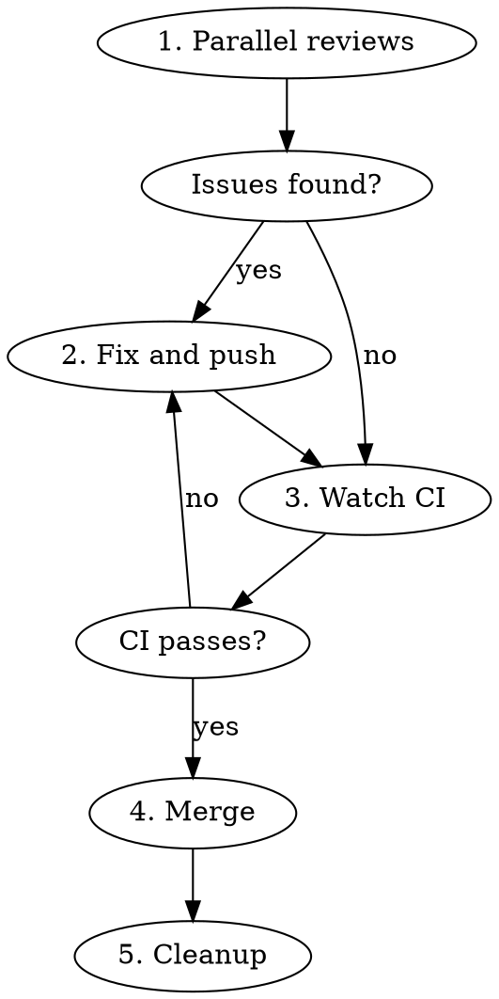

# Review, Merge, and Cleanup

## Overview

Completes PR lifecycle: parallel reviews → fix issues → merge → cleanup worktree.

Extends `merge-and-cleanup` by adding parallel code review step.

## When to Use

- PR created and CI passing
- Working in a git worktree
- Ready for final review before merge

## Workflow



## Steps

### 1. Parallel Reviews

Dispatch multiple review agents **in parallel** using Task tool:

- `superpowers:code-reviewer` (Claude Code plugin)
- `feature-dev:code-reviewer` (Claude Code plugin)

**Critical:** Use single message with multiple Task tool calls.

### 2. Fix Issues and Push

| Priority | Action |
|----------|--------|
| Critical | Must fix |
| Important | Should fix |
| Suggestion | Consider later |

```bash
git add -A && git commit -m "fix: review feedback" && git push
```

### 3. Watch CI

```bash
gh pr checks <PR_NUMBER> --watch
```

If CI fails → return to step 2.

### 4. Merge

```bash
# Note: --delete-branch causes errors in worktree, so omit it
gh pr merge <PR_NUMBER> --squash
```

### 5. Cleanup

```bash
# From main worktree (not the feature worktree!)
cd <MAIN_WORKTREE>

# Sync develop
git fetch origin && git checkout develop && git pull

# Remove worktree
git worktree remove <WORKTREE_PATH>

# Clean local branch
git branch -d <BRANCH_NAME> 2>/dev/null || true

# Prune and verify
git fetch --prune
git worktree list
git branch
```

## Common Mistakes

| Mistake | Fix |
|---------|-----|
| Single review only | Always run 2+ reviews in parallel |
| Merge before CI | Always `--watch` CI first |
| Skip fix-push-CI loop | Issues found → fix → push → CI → repeat |
| Cleanup from worktree | Must cd to main worktree first |
| Use --delete-branch in worktree | Omit flag, delete branch manually |
