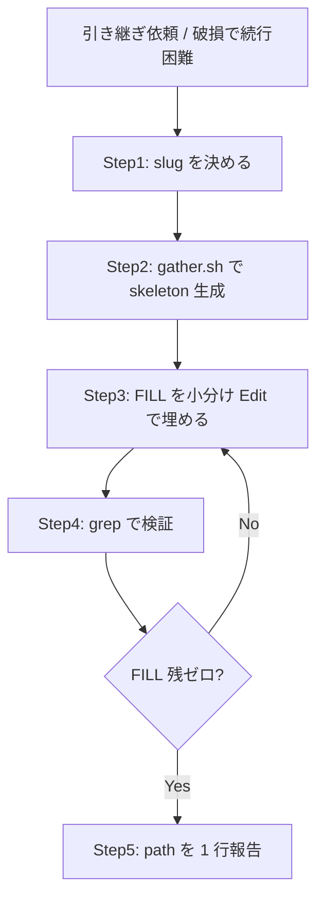

# セッション引き継ぎ書

## 概要

現セッションの全状態を `.tmp/handoff-<slug>.md` に self-contained に書き出し、新セッションが文脈ゼロから引き継げる状態を作れ。チャット履歴は出力破損(BUG-CC-49747)で壊れる前提で扱い、引き継ぎはファイルに寄せろ。

## 鉄則

- **引き継ぎはファイルに書け。壊れたチャットに頼るな**
- **メタ情報は `gather.sh` で集めろ。手で書くな**
- **`<FILL>` は 1 セクションずつ小さく Edit で埋めろ。1 回で大量に書くな(長ペイロードが破損を誘発する)**
- **確証ベースで書け。事実は file:line を添えろ。推測を書くな**
- **検証は grep でやれ。Read は phantom content を返しうる(破損 層2)**

## 使用場面

- ユーザーが「引き継ぎ書を書け」「別セッションに引き継ぐ」「ハンドオフして」と指示した時
- tool call の parse 失敗 / 出力の文字化け / `antml:` prefix 欠落が頻発し、現セッションの続行が困難な時(BUG-CC-49747 / issue #1195)
- 長時間セッションを畳んで新セッションへ作業を渡したい時
- 例外: チャットへの短い完了報告だけが必要なら `session-summary` を使え。本スキルは永続 self-contained ファイル生成専用

## 手順



### Step 1: slug を決めろ

作業内容を表す kebab-case を 1 つ決めろ(例: `model-naming-position`)。

### Step 2: gather.sh で skeleton を生成しろ

```bash
bash .claude/skills/session-handoff/gather.sh <slug>
```

- 出力 path が stdout に 1 行返る。以降その path を対象にしろ
- 日時 / cwd / branch / worktree / 直近 commit / 未コミット変更 / 自分の PR は自動収集済み
- 出力先は **現在の作業ツリーの `.tmp/`**(worktree なら worktree 内)。新セッションは同じツリーに `cd` して `cat` する設計だ
- worktree で生成した場合、引き継ぎが終わるまでその worktree を削除するな(doc が消える)

### Step 3: `<FILL>` を小分け Edit で埋めろ

`<FILL: ...>` を 1 セクションずつ Edit で実値に置き換えろ。

- 1 回の Edit に大量のテキストを詰めるな。長ペイロードは BUG-CC-49747 を誘発する
- セクション 3(確定した事実)は file:line を添えろ。新セッションが再調査せずに済む粒度にしろ
- セクション 5(次の一手)は順序付きの具体アクションにしろ。判断待ちの論点は明記しろ
- セクション 7(最初のコマンド)は新セッションが cwd を合わせ状態確認する実コマンドにしろ

### Step 4: grep で検証しろ

```bash
grep -n '<FILL' <path>   # 0 件なら埋め切れている
wc -l <path>
```

- `<FILL` が残っていたら Step 3 に戻れ
- 残ゼロを確認するまで完了するな
- Read で行数・内容を確認するな(破損 層2 で phantom content を返しうる)。grep / wc で機械確認しろ

### Step 5: path を 1 行報告しろ

チャットに生成 path を 1 行で報告しろ。新セッションへの渡し方も 1 行添えろ(例: 新セッションで `cat <path>` を最初に実行)。

## 検証チェックリスト

- [ ] `gather.sh <slug>` を実行し path を得た
- [ ] `<FILL` が 0 件(`grep -n '<FILL' <path>`)
- [ ] セクション 0 の「対象 issue / PR」を埋めた
- [ ] セクション 3 の事実に file:line が付いている(推測を書いていない)
- [ ] セクション 5 が順序付きの具体アクションになっている
- [ ] セクション 7 が実行可能なコマンドになっている
- [ ] 各 FILL を小分け Edit で埋めた(1 回の大量書き込みをしていない)
- [ ] 検証を grep / wc で行った(Read で確認していない)

全項目をチェックできない場合、引き継ぎ書は完成していない。Step 3 に戻れ。

## よくある言い訳

| 言い訳 | 現実 |
|---|---|
| 「チャットに書けば伝わる」 | チャットは破損する。ファイルに書け |
| 「メタ情報くらい手で書ける」 | 手書きは漏れる。`gather.sh` に任せろ |
| 「一気に全部書いた方が速い」 | 長ペイロードが破損を誘発する。小分けにしろ |
| 「Read で中身を確認すれば十分」 | 破損で phantom content が返る。grep で確認しろ |
| 「事実は記憶で書ける」 | 記憶は曖昧。grep して file:line を添えろ |

## 危険信号 - 停止

以下に気付いたら即座に止め、Step 1 に戻れ。

- `<FILL` を残したまま完了宣言しかけた
- 1 回の Edit に長文を詰め込もうとした
- 「たぶん」「だろう」で事実セクションを埋めようとした
- Read の行数報告を鵜呑みにして検証を済ませようとした
- gather.sh を飛ばして手書きで skeleton を作ろうとした

## アンチパターン

| ❌ NG | ✅ OK |
|---|---|
| 引き継ぎ内容をチャットに長文で書く | `.tmp/handoff-<slug>.md` に書く |
| メタ情報を手で打つ | `gather.sh` で自動収集 |
| 1 回の Write で全文を書く | セクション単位の小分け Edit |
| Read で FILL 残を確認 | `grep -n '<FILL'` で確認 |
| 事実を記憶で書く | grep して file:line を添える |
| 別ツリーの `.tmp/` を Edit しようとする | 自ツリーの `.tmp/`(gather.sh が `git rev-parse --show-toplevel` で自動解決) |

## 停止して相談すべき時

質問は 1 セッション 0〜1 回が上限。後から覆せない判断のみ確認しろ。

- 引き継ぐ作業範囲(どの issue / PR / worktree が対象か)が会話履歴から特定できない

## 連携

- 前段スキル: なし
- 後続スキル: なし(新セッションが手動で `cat <path>` して引き継ぐ)
- 関連スキル: `session-summary`(チャットへの短い完了報告。本スキルは永続 self-contained ファイル生成で用途が異なる)

## 結論

壊れたセッションで失われるのは、記録しなかった文脈だけだ。
