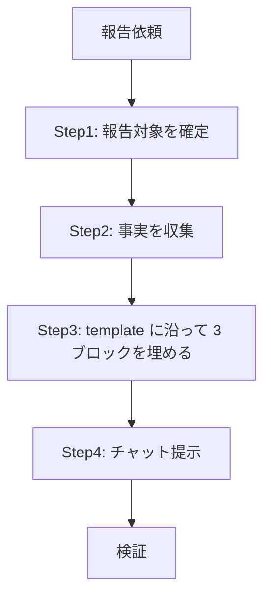

# セッション完了報告

## 概要

直近の作業を 3 ブロックで簡潔にチャット提示する。長文化させるな。

## 鉄則

- **簡潔さが命。長文化させるな**
- **事実のみ書け（推測・補完で埋めるな）**
- **PR 番号は `gh` で実在確認してから書け**
- **3 ブロック構成を崩すな**
- **チャット提示のみ。ファイル生成するな**

## 使用場面

- ユーザーから「完了報告」「セッションサマリー」「やったことまとめ」「振り返り」「PR まとめて」と指示があった時
- 直近の作業を簡潔に共有したい時
- 例外: GitHub issue への長文コメント投稿は本スキルの対象外。チャット提示専用

## 手順

### Step 1: 報告対象を確定しろ

直近の作業範囲をユーザー指示と会話履歴から決めろ。「このセッション全体」「直近 N 件の PR」「今日の作業」など、何を「直近」とするかを 1 行で確定しろ。

範囲が会話履歴から特定できない場合のみ、1 度だけユーザーに確認しろ。

### Step 2: 事実を収集しろ

| 収集対象 | 取得手段 |
|---|---|
| 完了した作業内容 | 会話履歴・TaskList |
| 報告対象 PR の状態 | `gh pr view <number> --json number,title,url,state,mergedAt` を 1 件ずつ叩け。`state` は `MERGED` / `OPEN` / `DRAFT` / `CLOSED` のいずれか |
| 自分の関連 PR 候補一覧 | `gh pr list --author "@me" --limit 20 --json number,title,url,state,mergedAt`（merged も open も同時に拾える） |
| follow-up | 会話履歴・open issue (`gh issue list --state open`)・open PR |

事実が確認できない項目は「情報なし」と書け。雰囲気で埋めるな。

### Step 3: template に沿って 3 ブロックを埋めろ

[`template.md`](template.md) を読み、3 ブロックをそのまま埋めろ。粒度に迷ったら [`sample.md`](sample.md) を参照しろ。

| ブロック | 内容 | フォーマット |
|---|---|---|
| ✅ 直近終わったこと | できるようになったことを一言。一言で表せない時のみ補足 | 1〜3 行 |
| 📋 サマリー（複数行動時のみ） | 複数 PR / 複数タスクを横並びで | テーブル（# / PR / 状態 / 概要 / やったこと）。`#` 列は `A` / `B` / `C`... を昇順で振れ（番号で指示を受けるための ID） |
| ⚠️ follow-up | **対応必須な項目のみ** 書け。判定基準は次節を見ろ。一言で表せない時のみ補足 | テーブル（# / 項目 / 何がまずいか / 補足）。`#` 列は `1` / `2` / `3`... を昇順で振れ（番号で指示を受けるための ID） |

単一作業のみの時はサマリーブロックを省略しろ。follow-up がない時は「該当なし」と書け。

### follow-up 判定基準

「対応必須」だけ書け。次のいずれかに該当するものが「対応必須」。

- 後続セッションが触らないと困るもの（blocker / 仕様未確定で待ち / レビュー指摘で未対応）
- バグ報告あり / 既知の不具合 / データ不整合
- 期限あり（リリース日 / 締切 / 外部依存の期限）
- 設計矛盾 / Out Of Scope だが対応必須と判定した残課題

次のものは書くな（該当なししか書かれないなら「該当なし」と書け）。

- 将来の rename / 廃止監視（実害なし、ウォッチのみ）
- nice-to-have の改善案 / リファクタ余地
- 「気になるだけ」「TTL 未指定で動作には影響なし」のような備忘
- 関連情報 / 参考リンクのメモ
- 「あったほうがいい」テスト追加（今動いている前提）

### Step 4: チャットに提示しろ

3 ブロックを 1 回のチャット投稿で完結させろ。ファイルに書き出すな。

## 検証チェックリスト

- [ ] 3 ブロックすべて出した（該当なしのブロックは「該当なし」と明記、または複数行動なしならサマリー省略）
- [ ] PR 番号は `gh` で実在確認した
- [ ] PR リンクは URL 全文を含む（クリック可能）
- [ ] PR 状態は `gh pr view --json state` の値（`MERGED` / `OPEN` / `DRAFT` / `CLOSED`）をそのまま書いた（推測で書かない）
- [ ] 各ブロックの「一言」は 1 文に収まっている
- [ ] 補足は「一言で表せない時だけ」入れた（不要な補足を入れていない）
- [ ] サマリーのテーブルヘッダーが `# \| PR \| 状態 \| 概要 \| やったこと` の 5 列・順序・名前ともに完全一致（`観点` 等への置換不可、`状態` 列省略不可、`#` 列省略不可）
- [ ] サマリーの `#` 列に `A` / `B` / `C`... を昇順で振った（番号指示用 ID、欠番なし）
- [ ] follow-up のテーブルヘッダーが `# \| 項目 \| 何がまずいか \| 補足` の 4 列・順序・名前ともに完全一致（カラム省略不可、`#` 列省略不可）
- [ ] follow-up の `#` 列に `1` / `2` / `3`... を昇順で振った（番号指示用 ID、欠番なし）
- [ ] follow-up に書いた全項目が「対応必須」の基準（後続セッションが触らないと困る / バグ報告あり / 期限あり / 仕様未確定で待ち）を満たしている（監視のみ / nice-to-have / 備忘を含めていない）
- [ ] 補足列で書くことが無い行は `—`（em dash）で空にした（`-` ハイフンや空白で代用しない）
- [ ] 推測・補完で埋めた箇所がない（不明は「情報なし」と書いた）
- [ ] 全体を 30 秒程度で読み切れる量に収めた

全項目をチェックできない場合、報告は完了していない。Step 1 に戻れ。

## よくある言い訳

| 言い訳 | 現実 |
|---|---|
| 「補足を書けば親切」 | 一言で表せたら補足は不要。冗長化はサマリーの敵 |
| 「PR 番号は記憶から書ける」 | `gh` で必ず実在確認しろ。番号間違いは信用を失う |
| 「全部 MERGED だろうから状態列を省く」 | OPEN / DRAFT が混じる時に読み手が混乱する。常に状態列を入れろ |
| 「不明だけど雰囲気で埋めとく」 | 「情報なし」と書け。雰囲気は推測 |
| 「テーブル不要、箇条書きで足りる」 | 複数行動は視覚整理のためにテーブル固定 |
| 「report.md に書き出した方が残せる」 | チャット提示のみ。永続化は明示依頼を受けた別作業 |

## 危険信号 - 停止

以下に気付いたら即座に止め、Step 3 に戻れ。

- 1 ブロックが 10 行を超え始めた → 削れ
- 補足が「一言」より長くなった → 一言を見直せ、または補足を削れ
- `gh` を叩かずに PR 番号を書こうとした → 叩け
- 推測補完しそうになった → 「情報なし」と書け
- 報告を `.tmp/` / `docs/` に書き出そうとした → チャット提示のみ

## アンチパターン

| ❌ NG | ✅ OK |
|---|---|
| 報告本文を `.tmp/` / `docs/` に書き出す | チャット提示のみ |
| issue に自動コメント投稿 | チャット提示のみ。issue コメントは明示依頼を受けてから |
| 全部箇条書きでベタ書き | 複数行動サマリーと follow-up は必ずテーブル |
| 監視のみ / 将来 rename / nice-to-have を follow-up に書く | 対応必須のみ。それ以外は書くな（「該当なし」と書け） |
| 補足を毎ブロックに入れる | 補足は「一言で表せない時だけ」 |
| 「たぶん」「だろう」で埋める | 事実ベース。不明は「情報なし」 |
| 1 セッションで複数回提示 | 1 回投稿で完結させろ |

## 停止して相談すべき時

質問は 1 セッション 0〜1 回が上限。後から覆せない判断のみ確認しろ。

- 報告対象（「直近」の範囲）が会話履歴から特定できない

## 連携

- 前段スキル: なし
- 後続スキル: なし
- 関連スキル: なし

## 結論

長文の報告は、読まれない。
