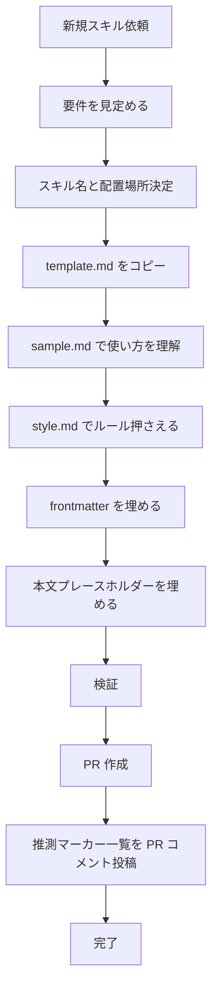

# スキル作成

## 概要

新規スキルを作る時、template.md をコピーして SKILL.md を生成する。

## 鉄則

- **テンプレ・サンプル・スタイルを読まずに書くな**
- **命令形で書け**
- **ハルシネーションするな**
- **推測は質疑なしで `（推測）` マーカー付けて完走させ、PR コメントで一覧表示しろ**（途中質問でユーザーを止めるな）

## 使用場面

- ユーザーが「新しいスキルを作りたい」「skill 化したい」と指示した時
- 既存スキルから派生スキルを作る時
- 例外: template.md / sample.md / style.md 自体の編集はメタ作業のため対象外

## 手順



### Step 1: 要件を見定めろ

**最重要ステップ。ここが曖昧なまま進めると、適当なスキルが出来上がる。**

ファイルを触る前に、ユーザーの依頼から以下を **明文化** しろ。
ユーザー明言以外の部分は推測で仮置きし、`（推測）` マーカーを付けろ。質問はするな。

- **ゴール**: このスキルが何を達成するか（1 文で）
- **背景**: なぜこのスキルが必要か / どんな課題を解決するか
- **やること**: 具体的に実装する機能・手順
- **やらないこと**: スコープ外として明示する内容（誤解防止）
- **DoD（Definition of Done）**: 何ができたら完了とみなすか

ここで整理した要件が、frontmatter の description / 本文の概要・使用場面・手順 の素材になる。

### Step 2: スキル名と配置場所を決めろ

- スキル名は kebab-case
- 配置先は `.claude/skills/<skill-name>/SKILL.md`
- 既存スキルとバッティングしないか `.claude/skills/` を確認しろ

### Step 3: template.md をコピーしろ

```bash
cp .claude/skills/skill-creator/template.md .claude/skills/<skill-name>/SKILL.md
```

### Step 4: sample.md を読んで使い方を理解しろ

完成例 @sample.md（PR レビュー Slack 通知）を読み、各セクションの埋め方・粒度・文体を把握しろ。

### Step 5: style.md で文体ルールを押さえろ

ファイルを触る前に @style.md を読め。

### Step 6: frontmatter を埋めろ

- `name`: スキル名（kebab-case）
- `description`: 発火条件 + 目的 + CSO キーワード散布
- 必要に応じて `user-invocable` / `context` / `agent` のコメントを解除して値を入れろ
- ファイル書き込みを伴うスキルでは `context: fork` を使うな

### Step 7: 本文プレースホルダーを埋めろ

- 全ての `<...>` を実値で置き換えろ
- Step 1 で整理した要件（ゴール / 背景 / やること / やらないこと / DoD）を本文に反映しろ

### Step 8: 検証

下記チェックリストを全項目クリアしろ。

### Step 9: PR 作成 → 推測マーカー一覧をコメント投稿

`commit-commands:commit-push-pr` で PR を作成したあと、推測で仮置きした箇所を `gh pr comment` で 1 コメントにまとめて投稿しろ。
ユーザーは PR 上で各項目に結論を出す。承認が出たら `（推測）` マーカーを一括削除して再コミットしろ。

```bash
gh pr comment <PR番号> --body "$(cat <<'EOF'
## 推測で仮置きした箇所

以下は明示指示がなく、ベスト推測で進めました。各項目に PR 上で結論をください。
承認後に `（推測）` マーカーを一括削除して再コミットします。

- `<ファイルパス>:<セクション>` — `<仮置き内容>`
  - 理由: `<なぜ推測か>`
- ...
EOF
)"
```

推測ゼロで完走できた場合、このコメント投稿はスキップしてよい。

## 検証チェックリスト

### プロセス確認

- [ ] `.claude/skills/<skill-name>/SKILL.md` に配置済み
- [ ] frontmatter の `name` / `description` が埋まっている
- [ ] 本文中に `<...>` プレースホルダーが残っていない

### ハルシネーション厳重チェック

スキル作成時に勝手なことを書かれると致命的。1 項目ずつ厳格に検証しろ。

- [ ] ユーザーが指示していない機能を勝手に追加していない
- [ ] API 名・関数名・コマンド・ファイルパスは grep / 公式ドキュメントで実在確認済み
- [ ] 推測で仮置きした箇所には全て `（推測）` マーカーが付いている
- [ ] 推測箇所を PR コメントに `gh pr comment` で投稿した（推測ゼロならスキップ可）
- [ ] 「たぶん」「おそらく」「だろう」「想定される」など推測語が本文に残っていない（マーカー以外）

全項目をチェックできない場合、スキル作成は完了していない。Step 1（要件見定め）に戻れ。

## よくある言い訳

以下の思考が浮かんだら、それは間違い。

| 言い訳 | 現実 |
|---|---|
| 「sample.md は読まなくてもわかる」 | 構造の細部は読まないと外す。読め |
| 「style.md は後で確認すればいい」 | 触る前に押さえろ。後回しは抜ける |
| 「ユーザーは X だけ言ったけど、Y も親切で追加しよう」 | ユーザーが指示した機能のみ書け。親切心は機能追加の言い訳ではない |
| 「sample に書かれてない手順を整合性のため追加しよう」 | sample にない機能を勝手に書くな。必要なら推測で仮置きし `（推測）` マーカーを付けろ |
| 「ユーザーは API 名を指定してないけど、たぶんこれだろう」 | grep / 公式ドキュメントで裏取り。それでも不明なら推測で仮置きし `（推測）` マーカー |
| 「推測したけどマーカー付けるの面倒」 | マーカーがないとハルシネーションが紛れ込む。必ず付けろ |
| 「だいたい合ってるから大丈夫」 | だいたい = ハルシネーションの種。事実のみ書くか、推測なら `（推測）` |

## 危険信号 - 停止

以下の思考や行動の兆候に気付いたら即座に作業を止め、Step 1 に戻れ。

- プレースホルダー `<...>` が残ったまま完了宣言しかけた
- template.md / sample.md / style.md を開かずに書き始めた
- 「だいたい合ってる」と感じた → 検証チェックリストで確認しろ
- 推測で書いたのに `（推測）` マーカーを付け忘れた → 必ず付けろ
- ユーザーへの確認を増やそうとしている → 推測で仮置き + マーカーで先に進めろ
- 推測の都度ユーザーへ質問しようとしている → 質疑なしで完走 → PR コメントでまとめろ
- PR 作成前に `（推測）` マーカーを外そうとしている → 外すのは PR で結論が出てから
- API 名・コマンドを grep / 公式ドキュメント未確認のまま書こうとしている → 裏取りしろ
- sample に存在しない機能を「整合性のため」と思って勝手に追加しようとしている → やめろ

## アンチパターン

| ❌ NG | ✅ OK |
|---|---|
| template.md を読まずにゼロから手書き | コピーしてから埋める |
| frontmatter なしで本文だけ書く | 必須 2 フィールド（name / description）から始めろ |
| プレースホルダーを残したままコミット | 全埋め後にコミット |
| context: fork でファイル書き込み系スキルを作る | 書き込み系は main コンテキストで実行 |
| ユーザー未指示の機能を「親切」で勝手に追加 | ユーザーが指示した機能のみ書け |
| API 名・コマンドを推測で書く | grep / 公式ドキュメントで実在確認してから書け |
| 不明点を都度ユーザー質問して中断 | grep / 公式ドキュメント裏取り → それでも不明なら推測仮置き + `（推測）` マーカー |
| 推測仮置きしたのに `（推測）` マーカーなし | 推測には必ずマーカー。ユーザーが見分けられるようにしろ |
| マーカー付けたまま マージ | ユーザー承認後にマーカーを全削除してからコミット（PR には付けたまま上げてよい） |
| 推測一覧を口頭/チャットでまとめて流す | `gh pr comment` で PR コメントに残せ。流れて消えると追えなくなる |

## 停止して相談すべき時

質問は 1 セッション 0〜1 回が上限。命名・ゴール・体裁は推測で仮置きしろ。
後から覆せない判断のみ確認しろ。

- 後から覆せない破壊的変更（既存スキルの大規模リファクタ等）
- スコープが想定外に拡大して 1 スキルに収まらない

## 推測マーカーの運用

ユーザー明言以外を書く時は `（推測）` マーカーで明示しろ。
ユーザーが「推測 vs ユーザー発言」を見分けて、推測箇所だけ重点確認できるようにする。

| 項目 | ルール |
|---|---|
| 付ける場所 | 推測で書いた箇所の直後に `（推測）` |
| 付ける範囲 | 命名 / 機能の選択 / 体裁 / 連携先など、ユーザーが明言していない全て |
| 質疑 | 質疑なしで完走しろ。途中質問でユーザーを止めるな（後から覆せない破壊的変更のみ例外） |
| 完了時 | PR 作成後、`gh pr comment` で推測箇所一覧を 1 コメントに投稿。ユーザーは PR 上で結論を出す |
| 外す時 | PR 上で各項目に結論が出たら、`（推測）` マーカーを一括削除して再コミット（マージ前） |
| 例 | `description: PR レビュー後に Slack 通知（推測）。code-review チェーン。` |

### PR コメントのフォーマット

```markdown
## 推測で仮置きした箇所

以下は明示指示がなく、ベスト推測で進めました。各項目に PR 上で結論をください。
承認後に `（推測）` マーカーを一括削除して再コミットします。

- `<ファイルパス>:<セクション>` — `<仮置き内容>`
  - 理由: `<なぜ推測か / 候補が他にあれば併記>`
- ...
```

## 連携

- 前段スキル: なし
- 後続スキル: `commit-commands:commit-push-pr` で PR 作成 → 直後に `gh pr comment` で推測マーカー一覧を投稿（スキルは PR + 推測まとめコメントとセットで完成）
- 関連スキル: なし

## 結論

ユーザー要件で固まっていないスキルは、負債だ。
