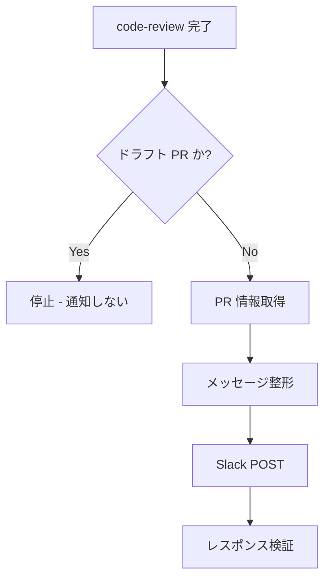

# PR レビュー結果 Slack 通知

## 概要

レビュー完了直後に結果をチーム Slack に流す。フィードバック反映の遅延を排除する。

## 鉄則

- **チーム通知なしでレビュー完了を認めるな**
- **Step 1〜4 を完走していない場合、完了を宣言するな**

## 使用場面

- code-review スキル完了時（自動チェーン）
- ユーザーから「Slack に通知」「PR 結果共有」と明示指示があった時
- 例外: ドラフト PR は通知しない

## 手順



### Step 1: PR 情報を取得しろ

```bash
gh pr view $PR_NUMBER --json title,author,url,isDraft
```

### Step 2: メッセージを整形しろ

タイトル / 著者 / レビュー結果（✅ / ⚠️ / 💬）/ URL を含めた日本語メッセージを組み立てろ。

### Step 3: Slack Webhook に POST しろ

```bash
curl -X POST -H 'Content-type: application/json' \
  --data "{\"text\":\"$message\"}" "$SLACK_WEBHOOK_URL"
```

### Step 4: 検証

POST のレスポンスが HTTP 200 であることを確認しろ。

## 検証チェックリスト

- [ ] curl の HTTP ステータスが 200
- [ ] Slack チャンネルにメッセージが表示されている
- [ ] PR URL がクリック可能なリンクとして表示されている

全項目をチェックできない場合、通知は完了していない。Step 1 に戻れ。

## よくある言い訳

以下の思考が浮かんだら、それは間違い。

| 言い訳 | 現実 |
|---|---|
| 「軽いレビューだから通知不要」 | 全レビューを通知する。例外なし |
| 「メッセージは適当でいい」 | フォーマット固定。逸脱禁止 |
| 「ハードコード URL でいいや」 | 環境変数必須。ハードコード禁止 |

## 危険信号 - 停止

以下の思考や行動の兆候に気付いたら即座に作業を止め、Step 1 に戻れ。

- 「たぶん」「おそらく」「だろう」を使い始めた → 推測してる
- 「とりあえず動けば OK」と感じた → 検証なしの完了宣言を疑え
- 「あとで通知しよう」と先送りしかけた → 今やれ

## アンチパターン

| ❌ NG | ✅ OK |
|---|---|
| レビュー本文を全文 Slack に流す | サマリだけ流す |
| 通知失敗を握りつぶす | HTTP ステータス検証必須 |
| Webhook URL を文字列リテラルでハードコード | `$SLACK_WEBHOOK_URL` 環境変数経由 |
| 通知メッセージを英語で書く | 日本語必須 |

## 停止して相談すべき時

質問は 1 セッション 0〜1 回が上限。後から覆せない判断のみ確認しろ。

- `SLACK_WEBHOOK_URL` 環境変数が未設定（実行不能）
- PR が複数チャンネルへの通知を要する（破壊的変更）

## 連携

- 前段スキル: `code-review`
- 後続スキル: なし（フィードバック収集はチーム手動）
- 関連スキル: `requesting-code-review`

## 結論

通知のないレビューは、無価値だ。
