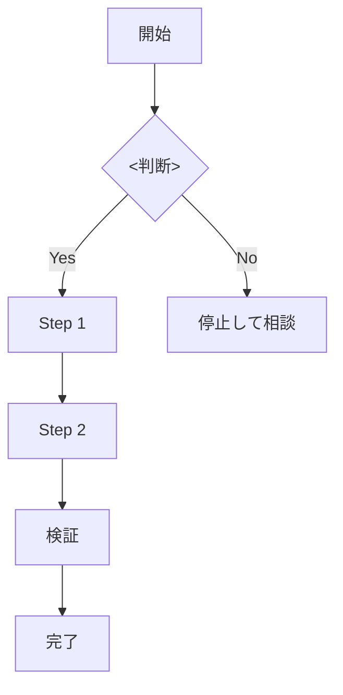

# <スキルタイトル>

## 概要

<1〜2 文で核となる原則を断言調で書け>

## 鉄則

- **<絶対ルール>**

例: **テストが赤くなるまで本番コードを書くな**

## 使用場面

- <発火する場面 1>
- <発火する場面 2>
- 例外: <例外を認める条件と承認プロセス>

## 手順

### Step 1: <動詞で始めろ>

<具体的な行動。コマンド例があれば fenced code block で>

### Step 2: <動詞で始めろ>

<具体的な行動>

### Step 3: 検証

<完了の証拠を取る具体コマンド>

## 検証チェックリスト

- [ ] <証拠ベースの完了条件 1（例: テストが green）>
- [ ] <条件 2（例: lint がゼロエラー）>
- [ ] <条件 3>

<全項目をチェックできない場合の罰則文を書け。例: 全項目をチェックできない場合、<対象>は完了していない。Step 1 に戻れ。>

## よくある言い訳

| 言い訳 | 現実 |
|---|---|
| 「これは簡単だからスキップしていい」 | 簡単な変更ほど壊れた時の発覚が遅い |
| 「テストは後で書く」 | 「後で」は来ない。今書け |
| <プロジェクト固有の言い訳> | <反論> |

## 危険信号 - 停止

以下に気付いたら即座に作業を止め、Step 1 に戻れ。

- <赤信号 1（例: 「たぶん」「おそらく」を使い始めた）>
- <赤信号 2（例: 同じ修正を 3 回試した）>
- <赤信号 3>

## アンチパターン

| ❌ NG | ✅ OK |
|---|---|
| <やってはいけないパターン 1> | <代わりにこうしろ> |
| <パターン 2> | <代替> |

## 停止して相談すべき時

質問は 1 セッション 0〜1 回が上限。後から覆せない判断のみ確認しろ。

- <ブロッカー条件 1（後から覆せない破壊的変更）>
- <ブロッカー条件 2>

## 連携

- 前段スキル: `<前に呼ぶべきスキル名>`
- 後続スキル: 完了したら `<次に呼ぶスキル名>` を呼べ
- 関連スキル: `<関連スキル>`

## 結論

<断言型で 1 文。例: 「<原則> は、<結果> だ。」または「<原則> がなければ、<結果> にならない。」>
