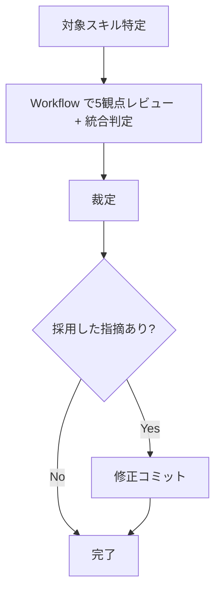

# スキルレビュー

## 概要

スキルの品質を5観点で並列レビューし、修正すべき点を特定する。

## 鉄則

- **Workflow で独立 agent によるレビューを実行しろ**（自己レビュー禁止）
- **指摘は裁定しろ**（鵜呑み禁止。採用/却下/スコープ外に分類）

## 使用場面

- スキルを新規作成した後の品質チェック
- 既存スキルの改善後の検証
- 例外: template.md / sample.md / style.md 自体の確認はメタ作業のため対象外

## 5観点

| # | 観点 | チェック内容 |
|---|---|---|
| 1 | テンプレート準拠 | template.md の構造に沿っているか。セクションの欠落・順序違いがないか |
| 2 | 初見理解性 | 新セッションが初めて読んだ時に誤認なく伝わるか。過剰に書きすぎていないか。書かなさすぎて伝わらないか |
| 3 | 目的達成性 | 概要で述べた目的を、手順を実行すれば達成できる内容になっているか |
| 4 | フロー成立性 | 作業フローとして成立しているか。Step の順序・前提条件に欠落がないか |
| 5 | 矛盾検出 | スキル内で矛盾した記述がないか。手順とチェックリスト、言い訳テーブルと危険信号の間に不整合がないか |

## 手順

### Step 1: 対象スキルの SKILL.md を特定しろ

引数またはユーザー指示から対象スキルのパスを確定しろ。

### Step 2: Workflow で5観点レビューを実行し統合判定を出せ

`Workflow` tool で5 agent を `parallel()` で並列実行しろ。

- 各 agent に対象 SKILL.md の全文と担当観点のチェック内容を渡せ
- 構造化出力（schema）で `{ perspective, verdict, findings[], summary }` を収集しろ
- template.md / style.md の内容も各 agent に渡して基準を明示しろ
- 統合判定も Workflow 内の最終 agent に任せろ
- 判定基準: critical / major が1件以上あれば要修正。minor / info のみならマージ可

### Step 3: 裁定しろ

統合判定の指摘を1件ずつ裁定しろ。

- **採用**: 修正コミットを積め
- **却下**: 実コードで事実確認し、理由を明記して却下
- **スコープ外**: follow-up issue を起票

裁定結果を PR コメントに記録しろ。

### Step 4: 修正が必要なら対応しろ

採用した指摘を修正コミットで反映しろ。

## 検証チェックリスト

- [ ] 5観点のレビューを Workflow で実行した
- [ ] 統合判定が出ている（マージ可 / 要修正）
- [ ] 指摘を裁定し PR コメントに記録した
- [ ] 採用した指摘を修正コミットで反映した

全項目をチェックできない場合、レビューは完了していない。Step 1 に戻れ。

## よくある言い訳

| 言い訳 | 現実 |
|---|---|
| 「作成した fork が自己レビューすれば十分」 | 自分の成果物を自分でレビューしても盲点は見つからない。独立 agent を使え |
| 「5観点は多すぎる。3つでいい」 | 5観点は最低ライン。削減するな |
| 「指摘を全部直せば間違いない」 | 裁定しろ。不要な修正は別の劣化を招く |
| 「小さいスキルだからレビュー不要」 | 小さいスキルほど構造の欠落に気づきにくい。レビューしろ |

## 危険信号 - 停止

以下に気付いたら即座に作業を止め、Step 1 に戻れ。

- Workflow を使わず手動で「レビュー済み」と報告しようとした
- 指摘を裁定せず全て採用/全て却下しようとした
- template.md を参照せずにテンプレート準拠を判定しようとした

## アンチパターン

| ❌ NG | ✅ OK |
|---|---|
| レビュー結果をチャットだけで流す | PR コメントに記録して資産化 |
| template.md を読まずにテンプレ準拠を判定 | template.md を agent に渡して基準を明示 |

## 停止して相談すべき時

質問は 1 セッション 0〜1 回が上限。後から覆せない判断のみ確認しろ。

- 対象スキルが複数ファイルにまたがり、どこまでレビュー範囲か判断できない
- レビュー結果と既存のプロジェクトルール（CLAUDE.md / rules）が矛盾する

## 連携

- 前段スキル: `skill-creator`（スキル作成後にこのスキルでレビュー）
- 後続スキル: なし
- 関連スキル: `refactor-issue-cycle`（リファクタチケット対応サイクル内のレビューステップ）

## 結論

レビューされていないスキルは、信頼できないルールだ。
