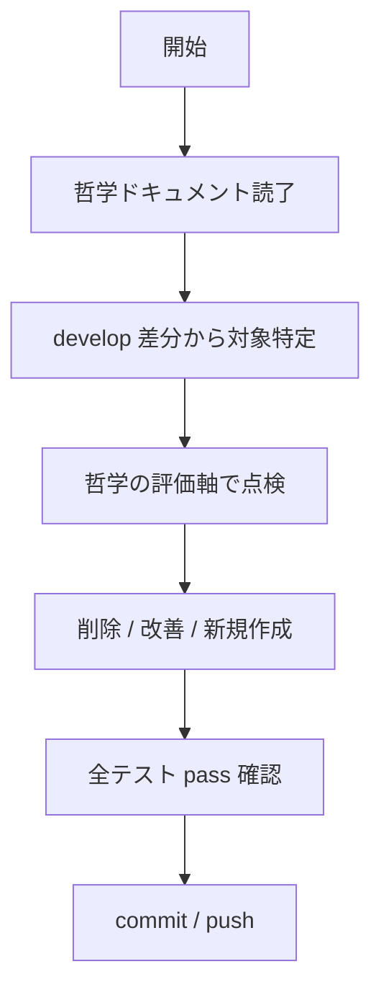

# テスト品質検証

## 概要

Google Testing Philosophy に基づきテストを点検し、価値のないテストを削除しクリティカルパスを保護する。

## 鉄則

- **「このテストはビジネスを守っているか?」を毎回問え**（守っていないテストは削除）
- **実装詳細ではなく振る舞いをテストしろ**（パブリック API / 状態を検証、内部状態や相互作用ではない）
- **モックは外部依存と非決定的処理のみ**（ビジネスロジックや DB 検証はモックするな）
- **テストが失敗したら実装を疑え**（テストを書き換えて緑にするな）

## 使用場面

- ユーザーから「テスト品質を見て」「無駄なテストを削って」「カバレッジを質的に見直して」と指示があった時
- PR レビューで価値の薄いテストや実装詳細依存のテストを発見した時
- リファクタ前にテストの耐性を確かめたい時
- 例外: 新規テストの初稿作成は別作業（本 skill は既存評価・改善）

## 手順



### Step 1: 哲学ドキュメントを読了しろ

評価軸を確立する。スキップ不可。

| 種類 | パス |
|------|------|
| Google Testing Philosophy | `docs/google-testing-philosophy.md` |
| Frontend テスト方針 | `client/docs/testing-philosophy.md` |
| Backend テスト方針 | `.claude/rules/backend/testing.md` |

### Step 2: 対象を特定しろ

```bash
git diff --name-only develop HEAD
```

変更/新規のテストファイル、テスト未作成の新規ソース、影響範囲（ビジネスロジック / UI / インフラ）を洗い出せ。
引数指定時は対象を引数のディレクトリ・ファイルに限定しろ。

### Step 3: 哲学の評価軸で点検しろ

Step 1 で読み込んだ哲学ドキュメントの評価軸（SMURF / Beyoncé Rule / 状態テスト / パブリック API / テストの価値基準）に従い、各テストの価値・耐性・モック妥当性を判定しろ。
評価にはテスト関数本体まで `Read` で確認しろ（必要なら `Grep` で位置特定）。

### Step 4: 削除 / 改善 / 新規作成しろ

Step 3 の判定に従い、削除 / 改善 / 新規作成のいずれかを実施しろ。判断基準は鉄則・アンチパターン・哲学ドキュメントを参照。

新規作成が必要なクリティカルパスの典型例（哲学ドキュメントに具体記述が無い場合の補助リスト）:

- エラー時のフォールバック動作
- 認証・認可ロジック
- データ変換・計算ロジック
- ビジネスルールの境界値

### Step 5: pass 確認 → commit / push まで完走しろ

```bash
# Frontend
bun run test
# Backend
uv run pytest
```

全テスト pass を確認したら、そのまま commit / push まで完走しろ。修正放置禁止。
本 skill の発火自体が「修正 + push まで」の指示として扱う。

## 検証チェックリスト

- [ ] 哲学ドキュメント 3 種を読了
- [ ] 対象を特定し、哲学の評価軸で点検
- [ ] 削除 / 改善 / 新規作成を実施
- [ ] 全テスト pass を確認
- [ ] commit / push 完了

全項目をチェックできない場合、品質検証は完了していない。Step 1 に戻れ。

## よくある言い訳

| 言い訳 | 現実 |
|---|---|
| 「カバレッジが下がるから削除しない」 | 数値ではなく質。価値のないテストはカバレッジに含めて意味がない |
| 「テスト名から価値判定すれば早い」 | 名前だけの判定はハルシネーション。`Read` で関数本体を読め |
| 「過去経緯はわからないが、見た目価値なさそうだから削除」 | `git blame` / `git log` で経緯確認。障害対応コミットなら「停止して相談」へ |

## 危険信号 - 停止

以下に気付いたら即座に作業を止め、Step 1 に戻れ。

- 哲学ドキュメントを読まずに評価し始めた → Step 1 はスキップ不可
- テスト関数本体を `Read` せずに削除 / 改善判断しようとした → Step 3 の前提が崩れる
- 過去障害対応の痕跡を確認せず削除しようとした → `git blame` で確認、痕跡があれば「停止して相談」へ

## アンチパターン

| ❌ NG | ✅ OK |
|---|---|
| `expect(mockFn).toHaveBeenCalled()` のみ | ユーザーが見える振る舞い（DOM / レスポンス / 副作用）を検証 |
| ビジネスロジックや DB アクセスをモック | モックは外部サービス・非決定的処理・重い処理・エラー条件のみ |
| 実装詳細（setState / private メソッド）を検証 | パブリック API を通じた振る舞い検証 |
| 失敗時にテストを書き換えて緑にする | 実装を直す。テストは仕様書 |

## 停止して相談すべき時

質問は 1 セッション 0〜1 回が上限。後から覆せない判断のみ確認しろ。

- 削除候補のテストが「過去の障害対応で追加された」痕跡があり、削除可否の判断に経緯文脈が必要
- クリティカルパスの定義がプロジェクト固有で、ドキュメントに無く判断不能

## 連携

- 前段スキル: なし
- 後続スキル: なし
- 関連スキル: `code-review:code-review`（PR レビュー時の補助として本 skill を呼ぶ側）

## 結論

価値を守らないテストは、リファクタを縛るだけの負債だ。
