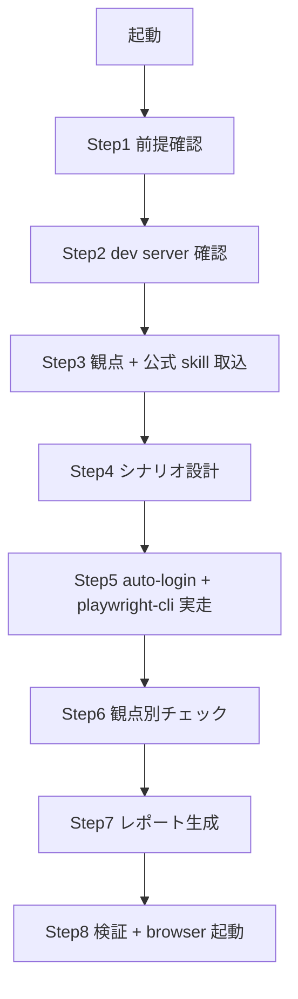

# verify-screen

## 概要

本 skill は **業務テストシナリオ設計 + 観点別チェック + HTML レポート生成** に集中する。
実 browser 操作 (open / goto / click / snapshot / screenshot 等) は Microsoft **公式 `@playwright/cli` の SKILLS** (`.claude/skills/playwright-cli/`、`setup-worktree` が `npx -y @playwright/cli@latest install --skills` で配置) に delegate する。

公式 `playwright-cli` の token 効率設計:

- snapshot は YAML (~200-400 tokens) で file 出力
- screenshot は PNG file 出力
- agent は file path だけ把握 (中身を都度 chat に返さない)
- ref (`e15` 等) で要素参照 (座標不要)

レポートは **main repo** の `.tmp/verify-screen/` 配下 (gitignore 済、worktree 削除耐性) に出す。

## senri 固有の前提

- **worktree 内でのみ実行**する (`.claude/worktrees/<name>/`)。main repo / クローンでは起動禁止
- BE/DB は docker、FE は local bun。port は worktree の `.env` (NEXT_PORT / UVICORN_PORT)
- 認証は fastapi-users の Bearer token。**auto-login → cookie 注入**で protected page に入る (詳細は後述)

## ファイル構成

| ファイル | 役割 |
|---|---|
| `SKILL.md` | このファイル。手順 / 鉄則 / 検証チェックリスト |
| `checklist.md` | 3 観点 (CRUD / レイアウト / 既存画面整合性) の評価基準 SoT |
| `template.html` | レポート出力の **コピー元**。実走時に `cp` して値を埋める |
| `lib.sh` | `is_worktree` / `resolve_ports` / `report_dir` / `assert_dev_up` / `assert_playwright_cli_skill` 等の共通関数 |

## 鉄則

- **skill 内で `mcp__playwright__*` を直叩きするな**。実行レイヤーは公式 `playwright-cli` shell commands に集約しろ (MCP 直叩きは token 効率を破壊する)
- **自前の Playwright spec / wrapper を書くな**。公式 `playwright-cli` skill に delegate
- **`playwright-cli` skill 未 install なら停止**。`lib.sh::assert_playwright_cli_skill` で guard
- **main repo では実行禁止**。`lib.sh::is_worktree` で停止
- **snapshot / screenshot は report_dir 配下に出せ**。`--filename=<report_dir>/snapshots/<phase>.yml` / `screenshots/<phase>.png` で絶対 path 指定
- **レポート出力先は main repo の `.tmp/verify-screen/<YYYYMMDDHHMMSS>-<ticket>-<slug>/` のみ**。`lib.sh::report_dir` の戻り値を使え
- **screenshot を機械チェック (snapshot YAML) だけで PASS と判定するな**。agent 自身が `Read` tool で PNG を開いて目視判定 (重なり / clipping / はみ出し / 折返し / 隠蔽) するまで完走と認めるな (`checklist.md` §2)

## 手順



### Step 1: 前提確認

```bash
source .claude/skills/verify-screen/lib.sh
worktree="$(git rev-parse --show-toplevel)"
is_worktree "$worktree" || exit 1
eval "$(resolve_ports "$worktree")"            # → NEXT_PORT / UVICORN_PORT 環境変数化
assert_playwright_cli_skill "$worktree" || exit 1
session="verify-$(basename "$worktree")"        # worktree ごとに一意な playwright session 名
```

`assert_playwright_cli_skill` が return 1 したら stderr の案内通り `npx -y @playwright/cli@latest install --skills` を実行してから再走。

### Step 2: dev server 起動確認

```bash
assert_dev_up "$worktree" || exit 1
```

未起動なら stderr に `bash .claude/skills/worktree-dev-up/up.sh "$worktree"` の案内が出る。skill 内で自動起動はするな。

### Step 3: 観点 + 公式 skill 取込

- `Read .claude/skills/verify-screen/checklist.md` で 3 観点を取込
- `Read .claude/skills/playwright-cli/SKILL.md` で公式 shell command 一覧を取込

### Step 4: 業務シナリオ設計

確認対象画面 / CRUD 有無を決め、シナリオ単位で「業務目的 / 期待挙動 / 検証方法」を書き出せ。`template.html` §0 と 1:1 で紐付ける。

- CRUD を含む場合: **一覧表示 → 登録 → 詳細参照 → 更新 → 削除** の 5 シナリオを全て設計
- シナリオ ID は `S-01` / `S-02` ... と operation の index を紐付け

レポート dir を確保:

```bash
scenario_slug="member-shipment-requests-crud"
out_dir="$(report_dir "$worktree" "$scenario_slug")"
echo "$out_dir"
```

### Step 5: auto-login + playwright-cli 実走

**全 `playwright-cli` 呼び出しに `-s=$session` を付けろ** (Step 1 で `session="verify-$(basename "$worktree")"` を算出済)。playwright-cli の session は **マシン全体で session 名管理**のため、固定名にすると並列 worktree が同一 browser を操作して混線する。worktree ごとに一意な名前にしろ。Bash tool は 1 コマンド = 1 プロセスなので、session 名で browser state を引き継ぐ。

**protected 画面なら最初に auto-login で cookie を注入する** (senri は Bearer token 方式。`/auth/callback` 中継は無い):

```bash
token=$(bash .claude/skills/worktree-dev-up/auto-login.sh "$worktree" | sed 's/^ACCESS_TOKEN=//')
playwright-cli -s=$session open "http://localhost:$NEXT_PORT/login"      # 同 origin の任意ページ
playwright-cli -s=$session eval "document.cookie='accessToken=$token; path=/'"
playwright-cli -s=$session goto "http://localhost:$NEXT_PORT/home"       # protected に着地 (ロール別 landing)
```

各シナリオを agent loop で進めろ (snapshot → ref 確認 → action → snapshot → ...):

```bash
playwright-cli -s=$session goto "http://localhost:$NEXT_PORT/..."
playwright-cli -s=$session snapshot --filename="$out_dir/snapshots/20260601100000-01-list.yml"
playwright-cli -s=$session screenshot --filename="$out_dir/screenshots/20260601100000-01-list.png"

playwright-cli -s=$session click e15                                    # 「+ 新規」
playwright-cli -s=$session fill e23 "サンプル" --submit
playwright-cli -s=$session screenshot --filename="$out_dir/screenshots/20260601100030-02-submitted.png"

playwright-cli -s=$session console     # client error 観測
playwright-cli -s=$session requests    # 4xx-5xx 観測
```

ファイル命名: `snapshots/<YYYYMMDDHHMMSS>-<NN>-<phase>.yml` / `screenshots/<YYYYMMDDHHMMSS>-<NN>-<phase>.png`。
snapshot YAML を Read するのは **ref を取りたい時のみ** (全文を chat に返すな)。

### Step 6: 観点別チェック

`checklist.md` の 3 観点 (CRUD / レイアウト / 既存画面整合性) を評価。**全 screenshot を `Read` tool で開いて目視判定**しろ (machine snapshot だけで PASS にするな)。screenshot 目視 5 観点は `checklist.md` §2 の手順を必ず通せ。

### Step 7: HTML レポート生成

```bash
cp .claude/skills/verify-screen/template.html "$out_dir/index.html"
```

`$out_dir/index.html` を Edit で埋めろ:

- ヘッダー: scenario 名 / worktree path / branch / timestamp / PR・issue link / dev server URL
- `#section-scenarios` に Step 4 のシナリオを 1:1 で書き出し + 結果列を ✅/⚠/❌
- `#section-operations` の `.op-block` を 1 operation 1 ブロックで複製し、操作名 / 対応シナリオ # / 期待 / 実 / console error 件数 / 4xx-5xx 件数 を埋める
- 各 `.op-shot-placeholder` を `.png" loading="lazy">` に置換し、snapshot YAML への link (`<a href="snapshots/<phase>.yml">view YAML</a>`) も併記
- `#section-layout` / `#section-consistency` の table に 項目 / 評価 / キャプチャ ID / コメントを埋める
- `#section-conclusion` に総合判定 / 問題点を埋める

### Step 8: 検証 + browser 起動

```bash
echo "$out_dir/index.html"
open "$out_dir/index.html"        # 必須: レポートを既定 browser で開く
playwright-cli -s=$session close    # 後片付け
```

その後「検証チェックリスト」全項目をチャットで復唱しろ。

## 検証チェックリスト

- [ ] `playwright-cli` の全 shell command が exit 0 で完走
- [ ] `<report_dir>/snapshots/*.yml` が全 phase 分出力されている
- [ ] `<report_dir>/screenshots/*.png` が全 phase 分出力されている
- [ ] **全 screenshot を `Read` tool で開いて目視判定した** (5 観点、`checklist.md` §2)
- [ ] `playwright-cli console` で error 件数 = 0 (>0 なら content を確認)
- [ ] `playwright-cli requests` で 5xx 件数 = 0 (>0 なら対象 endpoint を確認)
- [ ] `index.html` がブラウザで開き dark/light 両方で正常表示される
- [ ] §0 業務シナリオが業務順 (一覧 → 作成 → 参照 → 更新 → 削除) で並び結果列が ✅/⚠/❌ で確定
- [ ] 操作ブロック数が operation 数と一致し各 op-block に対応シナリオ # が紐付く
- [ ] レイアウト / 既存画面整合性 の観点セクションが評価済
- [ ] 全 `.op-shot-placeholder` が `` に置換され snapshot YAML link も併記
- [ ] §4 総括 (総合判定 + 問題点) が埋まっている

全項目をチェックできなければ verify-screen は完了していない。Step 4 に戻れ。

## よくある言い訳

| 言い訳 | 現実 |
|---|---|
| 「token 節約のため snapshot を MCP 直叩きで取りたい」 | 公式 `playwright-cli` に delegate しろ。MCP 直叩きは token 効率を破壊する |
| 「自前で playwright test spec 書いた方が一括実行できる」 | agent loop 型 (step ごとに snapshot 確認 → 判断 → action) が公式推奨 |
| 「登録だけ確認すれば CRUD 確認 OK」 | 一覧で見えるところまで到達しないと「データが残った」と言えない |
| 「機能が正常だからレイアウト PASS で OK」 | 機能 PASS とレイアウト FAIL は両立する。screenshot を Read で開いて目視しろ |
| 「login dialog を click して進めればいい」 | auto-login で token → cookie 注入が確実。dialog 経由は遷移待ち誤判定の元 |

## 危険信号 - 停止

- main repo / クローン (`/.claude/worktrees/` を含まない path) で起動しかけた → `is_worktree` で停止
- `playwright-cli` skill 未 install → `assert_playwright_cli_skill` で停止
- skill 内から `mcp__playwright__*` を直叩きしようとした → 公式 cli に閉じ込めろ
- レポート出力先を git 管理下 (`docs/` 等) や worktree 内 `.tmp/` に書こうとした → main repo の `.tmp/verify-screen/` のみ
- `worktree-dev-up` を skill 内で自動起動しようとした → 案内のみで停止

## 連携

- 前段: `setup-worktree` (port / docker stack / DB) → `worktree-dev-up` (next dev + auto-login)
- 前提 (auto install): `playwright-cli` (Microsoft 公式同梱)
- テンプレ起源: `html-document` (CSS 変数命名)

## 結論

画面は実走してキャプチャに残さなければ「確認した」と言えない。
実走は公式 `playwright-cli` に任せ、本 skill は業務シナリオ / 観点 / レポートに集中しろ。
