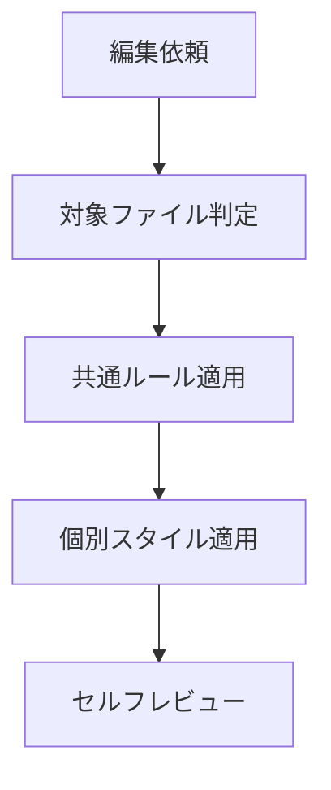

# 文体規約

## 概要

ドキュメントを書く・編集する時、対象ファイルに応じて共通ルール + 個別スタイル（`claude-style.md` / `docs-style.md`）を適用する。

## 鉄則

- **1 文 1 要点で短く書け**（長文はスキップされる）
- **箇条書きを優先しろ**（段落で構造を埋めるな）
- **事実以外を書くな**（情報源は (a) ユーザー発言 (b) 実在ファイル (c) 公式ドキュメント の 3 つのみ）
- **不明なら質問しろ**（推測・推察・想像で埋めるな）

## 使用場面

ドキュメント編集時、対象ファイルで適用ルールを切り替える。

| 対象 | 適用ルール |
|------|-----------|
| `CLAUDE.md`、`.claude/` 配下の `.md` 全般（`rules/` / `commands/` / `agents/` 等） | 共通ルール + `claude-style.md` |
| `docs/` 配下、`README.md` | 共通ルール + `docs-style.md` |

例外: コードブロック内のコメントは命令形ルール対象外（`# Initialize cache` を「キャッシュを初期化しろ」と書くと不自然）。

## 手順

### Step 1: 対象ファイルを判定しろ

「使用場面」表で対象ファイルがどちらかを確定し、適用するスタイルファイルを決定しろ。

### Step 2: 共通ルールを適用しろ

**簡潔性**:

- 1 文は短く、明確に
- 1 文 1 要点。複数要点を 1 文に詰め込むな
- 冗長な説明・前置き・補足は書くな

**フォーマット**:

- 箇条書きを優先（長文段落は禁止）
- 各項目は独立して理解可能に
- ネストで詳細を補足、粒度を合わせる
- 関連項目は階層構造で整理

**事実性**:

- 情報源は 3 つのみ: ユーザー発言 / 実在ファイル / 公式ドキュメント
- 推測・推察・想像で書くな
- 不明な点はユーザーに質問

### Step 3: 個別スタイルを適用しろ

Step 1 で決めた `claude-style.md` または `docs-style.md` を読み、命令形 / 文末 / 用語などのルールを適用しろ。

### Step 4: セルフレビューしろ

「検証チェックリスト」で確認しろ。

## 検証チェックリスト

- [ ] 対象ファイルに合うスタイル（claude-style / docs-style）を適用した
- [ ] 1 文 1 要点で短い
- [ ] 段落ではなく箇条書きを基本に構成した
- [ ] 事実のみで、推測語（「たぶん」「おそらく」「だろう」等）が残っていない
- [ ] コードブロック内コメントは命令形ルール対象外として残した

全項目をチェックできない場合、編集は完了していない。Step 1 に戻れ。

## よくある言い訳

事実性ルールを破る時の典型的な誘惑。以下の思考が浮かんだら、それは間違い。

| 言い訳 | 現実 |
|---|---|
| 「親切のために補足しよう」 | 親切心は事実より優先するな。ユーザーが求めたものだけ書け |
| 「整合性のために補完しよう」 | 補完は推測。書くな。質問しろ |
| 「たぶんこの API 名で合ってる」 | たぶんは禁止。grep / WebSearch で裏取りしろ |
| 「文脈から推察するに〇〇」 | 推察は推測。事実ではない |
| 「一般的にはこうだから」 | 業界一般 ≠ このプロジェクト。コードを読め |
| 「無いと不自然だから書き足す」 | 不自然なら質問しろ。書くな |
| 「だいたい合ってるから大丈夫」 | だいたい = ハルシネーションの種。事実のみ書け |

## 危険信号 - 停止

以下に気付いたら即座に作業を止め、Step 1 に戻れ。

- 1 文に複数要点を詰め込み始めた → 分割しろ
- 段落で長文を書き始めた → 箇条書きへ変換しろ
- 「たぶん」「おそらく」「想定」等の推測語を書きそうになった → 事実確認、なければ質問
- 対象ファイルを判定せずに書き始めた → Step 1 必須

## アンチパターン

| ❌ NG | ✅ OK |
|---|---|
| 1 文に複数要点を詰め込む | 1 文 1 要点で分割 |
| 段落で長文を書く | 箇条書き + ネストで構造化 |
| 推測で API 名 / ファイルパスを書く | grep / WebSearch / 公式 docs で裏取り |
| 不明点を「親切」「整合性」で勝手に補完 | ユーザーに質問しろ |

## 停止して相談すべき時

質問は 1 セッション 0〜1 回が上限。後から覆せない判断のみ確認しろ。

- 共通ルールと個別スタイル（claude-style / docs-style）が衝突しており、優先順位の判断にプロジェクト方針が必要

## 連携

- 前段スキル: なし
- 後続スキル: なし
- 関連スキル: なし（CLAUDE.md から `@` 記法で本 skill を参照）

## 結論

長文と推測は、ドキュメントを腐らせる。
